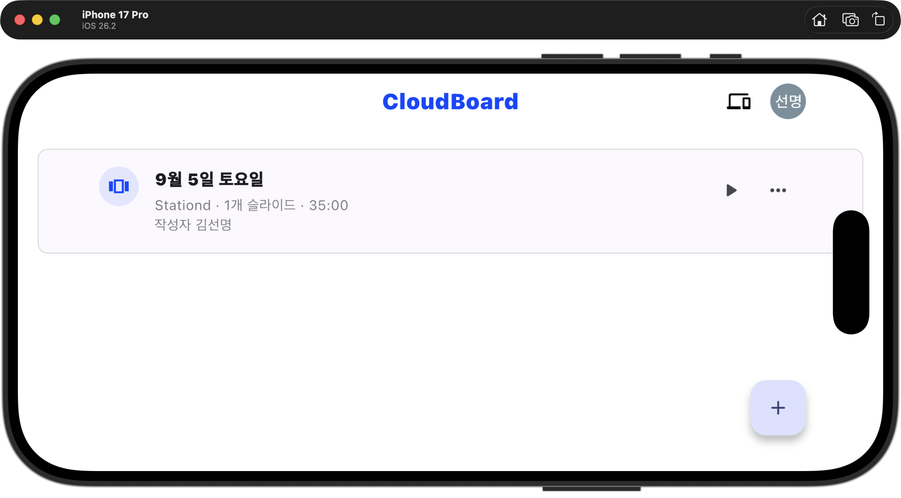
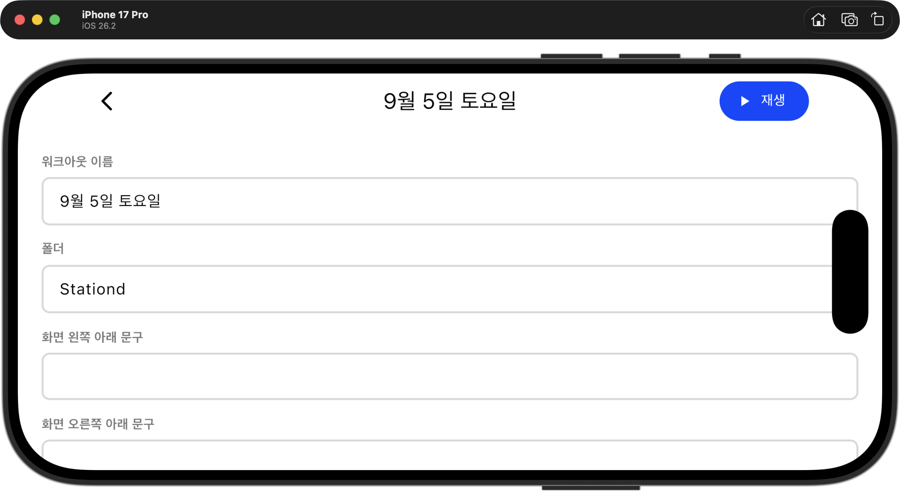
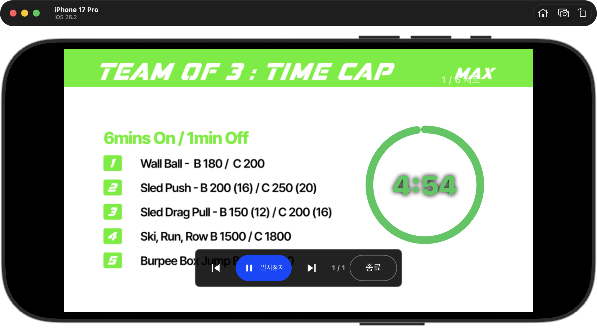
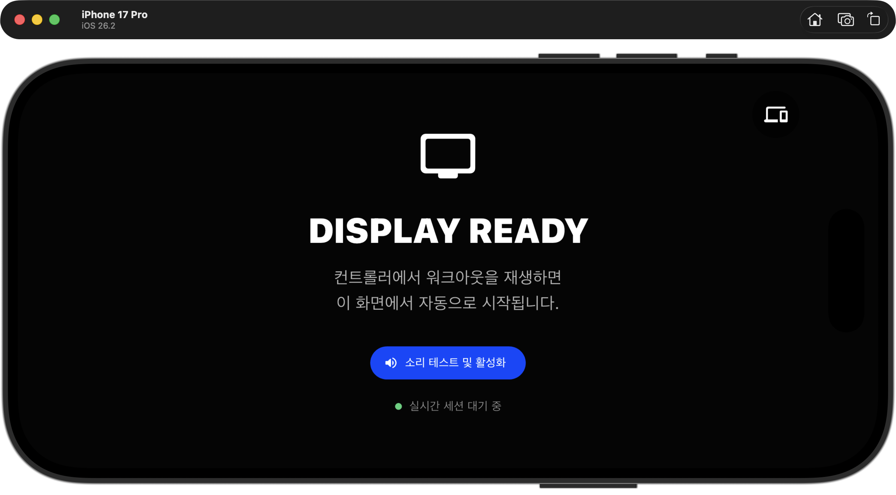

# CloudBoard 매장 파일럿 준비 계획

## 목표

CloudBoard를 그룹 수업 운영용 스마트 디스플레이로 실제 매장에서 10회 이상 연속 테스트할 수 있는 수준으로 만든다. 파일럿의 핵심은 기능 수가 아니라, 60분 수업 중 연결과 화면이 끊겨도 코치가 즉시 복구할 수 있는 운영 안정성이다.

## 현재 흐름 감사

### 1. 워크아웃 목록 — 양호

- 제목, 슬라이드 수, 전체 시간과 재생 버튼의 우선순위가 명확하다.
- 실제 운영에 필요한 검색, 폴더 필터, 최근 사용, 오늘 수업, 디스플레이 준비 상태는 아직 없다.
- 재생을 누르기 전에 어느 화면으로 송출되는지 확인할 방법이 없다.

### 2. 워크아웃 편집 — 개선 필요

- 시간, 이미지, 타이머, 색상 등 핵심 구성은 갖췄다.
- 긴 단일 폼이라 슬라이드가 많아질수록 탐색과 검수가 어렵다.
- 저장 여부, 미저장 변경, 필수값 오류, 이미지/사운드 준비 여부가 명확하지 않다.
- 수업 직전에 전체 슬라이드를 빠르게 점검하는 미리보기/검수 모드가 필요하다.

### 3. 재생 컨트롤러 — 핵심 경험 양호, 운영 안전성 부족

- 타이머와 운동 정보가 멀리서도 잘 보이고 핵심 조작이 단순하다.
- 하단 제어 패널이 운동 내용을 가릴 수 있다. 일정 시간 뒤 자동 숨김이 필요하다.
- 네트워크 상태, 연결된 디스플레이 수, 마지막 동기화, 명령 전달 성공 여부가 보이지 않는다.
- 실수로 이전/다음/종료를 누르는 상황을 막는 잠금 또는 종료 확인이 필요하다.
- 이미지 밝기를 유지하면서 글자를 읽을 수 있도록 텍스트 영역에만 선택적 그라데이션/배경을 둘 수 있어야 한다.

### 4. 디스플레이 대기 — 시각적으로 양호, 페어링 정보 부족

- 대기 상태와 소리 테스트가 명확하다.
- TV마다 Google 로그인이 필요하고, 기기 이름·소속 매장·온라인 상태·연결 코드가 없다.
- 연결이 끊겼을 때 자동 재시도 중인지, 코치가 무엇을 해야 하는지 알 수 없다.

## 기술상 현재 한계

- 재생 세션이 사용자별 단일 `activeSession`이라 동시에 여러 수업 공간이나 존을 운영할 수 없다.
- 디스플레이가 코치와 같은 계정으로 로그인해야 하며, 매장·멤버·기기 권한 모델이 없다.
- 기기 모드와 임의 기기 ID만 로컬에 저장되고 정식 페어링/해제/분실 처리 흐름이 없다.
- 연결 상태 감지, 오프라인 표시, 명령 확인 응답, 세션 만료와 자동 복구가 없다.
- 화면 켜짐 유지, 앱 재시작 후 세션 복원, 백그라운드/포그라운드 전환 검증이 부족하다.
- 자동 배포는 웹 빌드만 수행하며 분석, 테스트, Firebase 규칙 테스트가 배포 관문에 없다.
- 자동 테스트는 핵심 계산 위주의 8개뿐이며 실제 수업 흐름, 다중 기기, 네트워크 단절 테스트가 없다.
- 크래시 리포트, 성능 측정, 운영 로그와 장애 알림이 없다.

## 개발 로드맵

### 0단계 — 파일럿 범위 고정 (1~2일)

- 첫 매장 1곳, 코치 2~3명, 디스플레이 1~2대, 수업 유형 1개로 범위를 제한한다.
- 지원 기기를 iPad/웹 TV 중 하나로 먼저 고정한다.
- 수업 시작, 일시정지, 단계 이동, 종료, 연결 끊김 시 기대 동작을 문서화한다.
- 파일럿 피드백 기록 양식과 장애 기록 방식을 정한다.

### 1단계 — 수업이 멈추지 않는 재생 엔진 (5~7개발일, 최우선)

- 네트워크가 끊겨도 각 디스플레이가 저장된 세션 스냅샷으로 타이머를 계속 진행한다.
- 재연결 시 서버 시간과 현재 단계로 자동 보정하고 중복 명령을 방지한다.
- 앱 종료/재실행, 화면 잠금, 백그라운드 복귀 후 활성 수업을 복원한다.
- 화면 켜짐 유지, 가로 방향 고정, 전체 화면 복귀를 보장한다.
- 마지막 슬라이드는 자동 종료하지 않고 코치가 명시적으로 종료하도록 유지한다.
- 이전/다음/종료 오조작 방지와 종료 확인을 추가한다.

### 2단계 — 기기 페어링과 운영 상태 (7~10개발일)

- TV에 QR/6자리 코드를 표시하고 코치가 승인하는 페어링 흐름을 만든다.
- 디스플레이는 Google 로그인 없이 기기 토큰으로 자동 연결한다.
- 기기 이름, 매장, 온라인/오프라인, 마지막 접속, 앱 버전을 저장한다.
- 컨트롤러에 연결된 디스플레이 수와 각 기기의 명령 수신 상태를 표시한다.
- 세션을 `매장 + 공간/존` 단위로 분리해 여러 화면과 수업을 안전하게 지원한다.
- 페어링 해제, 기기 분실, 토큰 회전과 Firebase 권한 규칙을 추가한다.

### 3단계 — 수업 전 준비와 콘텐츠 안전성 (4~6개발일)

- `수업 시작 전 점검` 화면에서 디스플레이, 네트워크, 소리, 이미지 캐시를 한 번에 확인한다.
- 시작 전 3초 카운트다운과 첫 단계 확인을 추가한다.
- 워크아웃 자동 저장, 미저장 변경 경고, 필수값 검증과 버전 복구를 추가한다.
- 슬라이드 전체 미리보기와 총 수업 시간/휴식 구조 오류 검사를 제공한다.
- 이미지 사전 다운로드와 실패 대체 화면을 추가해 수업 중 깨진 이미지를 방지한다.
- 최근 사용, 즐겨찾기, 폴더 필터로 수업 시작 시간을 줄인다.

### 4단계 — 배포·관측·현장 검증 (5~7개발일)

- CI에 포맷, 정적 검사, 단위/위젯 테스트, 웹 빌드, Firebase 규칙 테스트를 추가한다.
- 개발/스테이징/운영 Firebase 환경을 분리하고 배포 롤백 절차를 만든다.
- 크래시 리포트, 앱 버전, 세션 이벤트, 연결 실패와 이미지 로드 실패를 수집한다.
- 컨트롤러 1대 + 디스플레이 2대로 네트워크 단절, 앱 강제 종료, 화면 잠금, 장시간 재생 테스트를 자동화한다.
- 실제 매장에서 10회 수업을 운영하고 매회 준비 시간, 장애, 수동 복구 횟수와 코치 피드백을 기록한다.

## 파일럿 합격 기준

- 60분 수업 10회 동안 타이머가 멈추거나 잘못된 단계로 이동하는 치명적 장애가 0회다.
- Wi-Fi를 30초 끊어도 화면은 계속 재생되고, 복구 후 5초 안에 모든 화면이 같은 단계로 맞춰진다.
- 앱을 강제 종료하고 다시 열어도 10초 안에 진행 중 수업으로 복익
- 수업 준비 점검을 1분 안에 끝내고, 코치가 별도 기술 지원 없이 복구할 수 있다.
- 이미지 깨짐, 화면 꺼짐, 자동 종료, 중복 재생이 발생하지 않는다.
- 파일럿 코치 3명 중 2명 이상이 두 번째 수업부터 도움 없이 운영한다.

## 파일럿 이후로 미룰 항목

- 구독 결제와 요금제
- 회원 예약·출석·CRM
- 템플릿 마켓
- 다지점 본사 대시보드
- 상세 운영 분석과 매출 리포트
- Spotify/Apple Music 연동

이 항목들은 제품의 반복 사용이 확인된 뒤 개발해도 파일럿 검증에 지장이 없다.

## 접근성 및 검증 한계

- 캡처된 화면 기준으로 주요 버튼 크기와 핵심 정보의 시각적 위계는 양호하다.
- 회색 보조 문구의 대비, 배경 이미지별 텍스트 대비, 키보드/리모컨 포커스 순서, 화면 읽기 순서는 실제 기기 테스트가 필요하다.
- 이번 감사는 iPhone 17 Pro 시뮬레이터의 가로 화면과 단일 계정/단일 세션을 기준으로 했다. Android TV, 실제 iPad, 저속 Wi-Fi, 다중 디스플레이 성능은 아직 검증하지 않았다.
