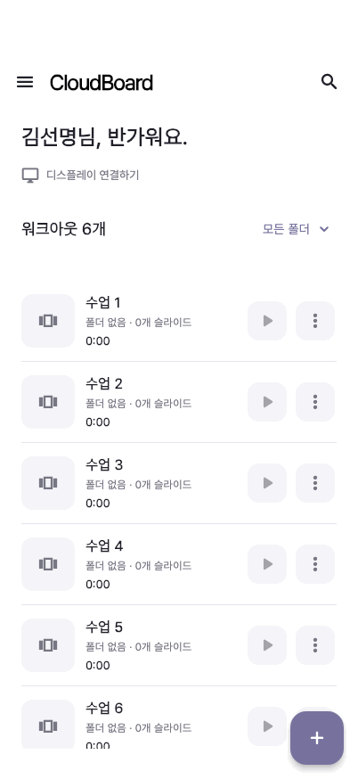

# STA-112 · 앱 모션 구현 1차

기준: `develop@ff7bb90`. 기존 화면에 공통 모션 정책과 짧은 조작 피드백을 적용한다. 데이터 요청·저장·재생 명령은 기존 controller/usecase가 소유하며 효과가 끝나기를 기다리지 않는다.

## 적용한 동작

| 영역 | 동작 | 유지하는 계약 |
| --- | --- | --- |
| 웹 화면 이동 | 180ms fade | GoRouter 경로·인증 redirect·이탈 가드는 그대로 사용 |
| iOS / Android 화면 이동 | Flutter 기본 전환 | 뒤로 스와이프·predictive back 구현을 덮어쓰지 않음 |
| 라이브러리 분류 | 선택한 본문 180ms reveal | 단일 child 유지, 기존 검색·분류 상태 로직 유지 |
| 주요 FAB | 눌림 120ms / 0.98배 | 기존 hit target, Material 동작, 키보드 실행 유지; 취소·비활성화 시 복원 |
| 저장 상태 | 저장 / 진행 중 / 저장됨 아이콘 180ms | 실제 저장 결과와 dirty 상태로 결정; 실패를 성공으로 표시하지 않음 |
| 디스플레이 연결 | 온라인·오프라인 문구 180ms | 실제 연결 상태만 관찰 |
| 비동기 액션 | dim·상태 등장 180ms | busy가 입력 차단/해제를 즉시 결정; 상태를 한 번만 semantics로 제공 |
| 홈 모바일 목록 | 변경된 항목 180ms fade + 높이 변화 | ID 기반 유지, 나가는 행은 입력·semantics 제외 |
| 미니 컨트롤 | 영역 확보·회수 240ms, 등장·재생 상태 180ms | 본문과 player owner 유지, 매초 숫자 변경으로 효과 재시작하지 않음 |
| 시트 / 기존 내부 탭 | 시트 240ms 진입·180ms 닫기, 선택 220ms | 기본 시트 드래그·닫기 및 기존 탭 상태 유지 |
| 로그인 / 온보딩 | 기존 420ms 소개 효과 | 입력·선택·포커스와 단일 subtree 유지 |
| TV 대기 화면 | 기존 슬라이드 600ms, 위치 보정 2초 | 송출 시간·오디오 계산과 분리; 모션 감소 시 정적 표시 |

워크아웃 목록의 필터·페이지·정렬 변경은 즉시 교체한다. 8개를 넘는 대량 추가/제거도 애니메이션 없이 반영하고 기존 행을 유지한다. 태블릿 그리드와 라이브러리 개별 항목 애니메이션은 이번 적용 대상이 아니다.

## 재사용 규칙

- `AppMotion`: feedback 120 / stateChange 180 / selection 220 / layout 240ms, `easeOutCubic`. 소개 420, 홈 shimmer 1300, 복귀 로더 1200, 대기 슬라이드 600ms는 목적에 따른 별도 값이다. 이 값들은 성능 측정 결과나 OS의 강제 기준이 아니다.
- `AppContentTransition`: 실제 상태를 나타내는 `transitionKey`가 바뀔 때만 실행한다. 동일한 child를 유지하고 폼이나 provider를 복제하지 않는다. 일반 재빌드와 접근성 설정 복귀는 재실행 조건이 아니다.
- `AppPressFeedback`: 기존 컨트롤을 감싼다. 액션 callback·semantics·포커스를 새로 만들지 않는다.
- `AppAnimatedSliverList`: 확정된 데이터 snapshot을 표시한다. 저장/삭제 성공 판정은 소유하지 않는다. 서버 성공 전 삭제를 보류하는 `AnimatedDisplayList`의 계약은 별도로 유지한다.
- `disableAnimations` 또는 `accessibleNavigation`이면 적용한 장식 효과를 정적으로 대체한다. 상태·오류·선택 의미는 유지한다. 기존 기본 플랫폼/Material 효과 전체를 재구현하는 정책은 아니다.
- 미니 컨트롤은 본문과 형제 위치에 고정한다. 감소 모드에서는 `AnimatedSize`를 우회하며, keyed subtree를 재사용해 player 수명을 보존한다. 큰 글꼴에서는 바 높이가 늘고 재생 시간 텍스트가 줄바꿈된다.

## 실제 위젯 렌더링 기록

402 × 874 논리 px, Pretendard, 상단/하단 안전 영역 62/34. 실제 `WorkoutListScreen`에 테스트 repository의 확정 응답을 전달했다. 순서: FAB 눌림·취소 → 새 서버 목록으로 첫 행 삭제 → 다음 서버 목록에서 다시 추가.

| 일반 모션 | 모션 감소 |
| --- | --- |
|  |  |

각 GIF는 40ms 간격의 실제 Flutter 렌더 72장이다. 입력 취소와 서버 응답을 코드로 재현한 기록이며, 실기기 녹화 또는 실제 FPS 측정이 아니다. 변경 전 영상은 새로 촬영하지 않았다.

재생성:

```sh
fvm flutter test --no-pub tool/app_motion_capture_test.dart
# macOS ImageIO로 프레임 시간 그대로 GIF 인코딩
swift tool/render_motion_gif.swift build/motion-capture/normal docs/design/app-motion-2026-10-10/home-motion.gif
swift tool/render_motion_gif.swift build/motion-capture/reduced docs/design/app-motion-2026-10-10/home-reduced-motion.gif
```

## 검증

Flutter 전체 테스트 **676개**, Chrome 모션·라우팅·편집 탭 **16개**, 위젯 프레임 캡처 **1개** 통과. `flutter analyze --no-pub` 이상 없음, `dart format --output=none --set-exit-if-changed lib test` 555개 파일 변경 없음, `git diff --check` 통과. 추가/확장한 회귀 검증:

- 상태 전환·접근성 설정 변경 중 텍스트·선택·포커스·element 유지.
- 눌림 취소/비활성화, 원래 hit target, 키보드 실행, busy의 즉시 차단/해제.
- 연속 목록 snapshot, 추가/제거/재정렬, 대량 페이지의 기존 행 유지, 필터 변경, 나가는 행 입력 차단.
- 일반/접근성 모션 감소에서 반복 장식 ticker 종료.
- 미니 컨트롤 등장·키보드 숨김·프로필 이동·전체 화면·복귀 동기화·외부 종료 중 세션과 본문 유지.
- 320 × 568에서 글자 200%와 모션 감소, 390 × 844와 834 × 1194. 실행 중 감소 설정 왕복에도 player owner와 컨트롤 element 유지.
- 기존 저장 실패/재시도, 홈 페이징/검색/스크롤, 라이브러리, 기기 제거, 인증 및 타이머 회귀.
- Chrome에서 공통 모션, 인증 라우팅, 편집 탭(320 / 390 / 가로 844 / 태블릿 834 폭).

## 남은 단계

[STA-111](https://linear.app/clyrdev/issue/STA-111)의 메인 4탭·도크는 [PR #36](https://github.com/hyroxseouldev/cloud_board/pull/36)에서 별도 검토 중이다(개발 종료 시점 확인). develop에 반영되면 전역 탭 전환과 도크 위 미니 컨트롤에 연결하고 통합 회귀를 수행한다. 현재 PR은 `develop@ff7bb90`의 탐색 구조를 대상으로 한다. [STA-97](https://linear.app/clyrdev/issue/STA-97)의 저장 확정·초안 복구 구현도 별도 작업이다.

실제 iPhone/Android 뒤로가기 제스처, Android TV 리모컨·스크린리더 실기기 검수와 같은 기기 profile/release 전후 20회 측정(UI/raster p95, 프레임 예산 초과 비율)은 미실시다. 정적 화면과 widget test만으로 해당 수용 기준을 완료 처리하지 않는다.
