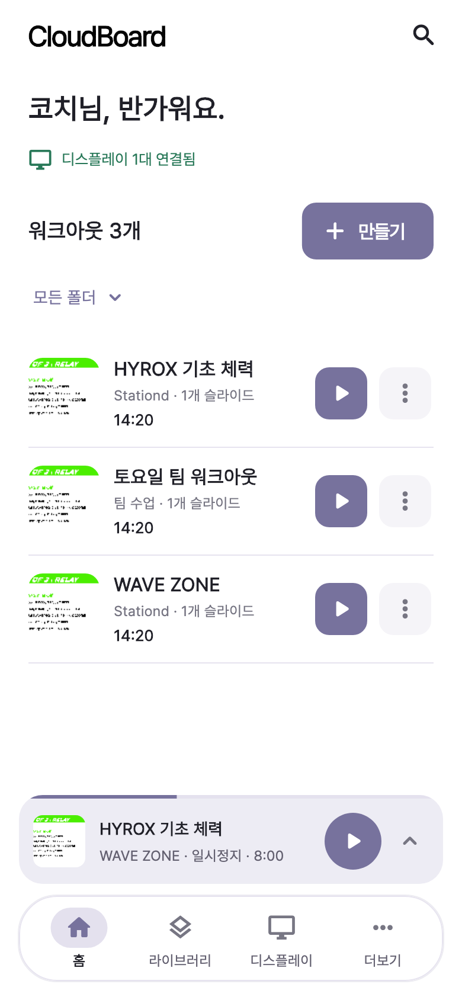
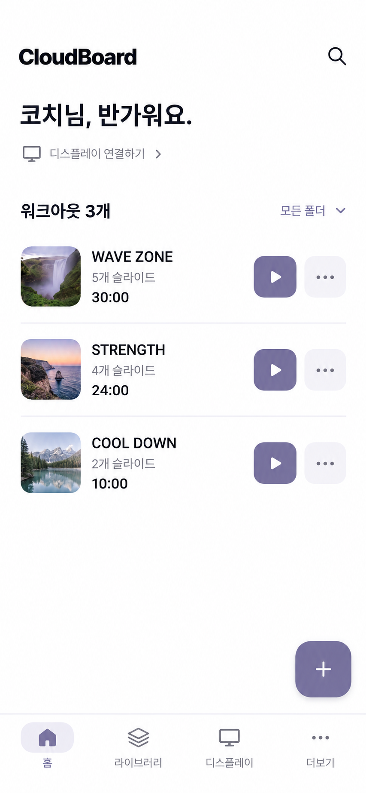
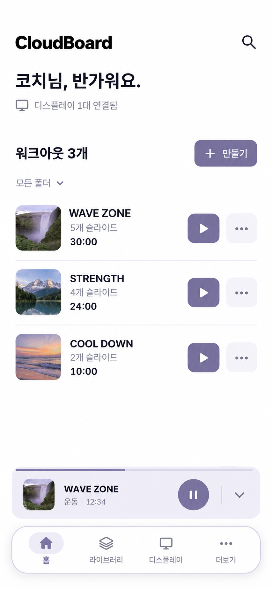
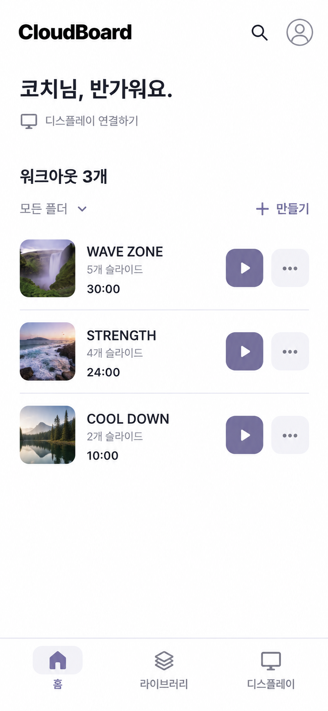

# 메인 바텀 내비게이션 리디자인

기획: [STA-111](https://linear.app/clyrdev/issue/STA-111)

2026-10-10 · 선택한 2안 앱 구현 · STA-111

## 선택한 방향 · 2026-10-10

사용자 피드백에 따라 **대화에서 두 번째로 표시된 시안, ‘미니 컨트롤 + 도크’**를 선택안으로 삼는다. 원본은 **02-playback-dock.png**이며 1·3안은 비교 이력으로 보관한다.

- 하단은 **홈 · 라이브러리 · 디스플레이 · 더보기** 4개 탭을 담은 둥근 도크로 구성한다. 기존 라벤더 색상과 가벼운 그림자를 유지한다.
- 수업 진행 중에는 미니 컨트롤을 도크 바로 위에 분리 배치한다. 수업이 없으면 미니 컨트롤 자리까지 콘텐츠 공간으로 돌려준다.
- **+ 만들기**는 워크아웃 제목 오른쪽에 배치한다. 이 안에서는 우하단 FAB를 제거한다.
- 좌우 여백 약 16, 도크와 미니 컨트롤 간격 8–12 논리 px를 출발점으로 삼고 기기 하단 안전 영역을 추가한다. 콘텐츠가 마지막 항목까지 보이도록 하단 높이를 실제 레이아웃에 반영한다.
- 작은 화면과 큰 글자에서는 도크·미니 바의 높이가 늘어날 수 있다. 둥근 형태를 유지하면서 라벨·제어 버튼이 잘리지 않도록 한다.

**선택한 2안을 실제 Flutter 앱에 구현했다.** 아래 생성 시안은 디자인 기준이며, 구현 캡처는 다음 절에서 구분한다.

## 실제 구현



- [수업이 없는 홈](idle-implemented.png) · [라이브러리](library-implemented.png) · [더보기](more-implemented.png)
- [320px](compact-implemented.png) · [글자 200%](large-text-implemented.png) · [가로 화면](landscape-implemented.png) · [태블릿](tablet-implemented.png) · [데스크톱](desktop-implemented.png)
- 실제 앱 라우터/위젯을 로컬 데이터로 렌더링했다. 예시 워크아웃, 연결 상태, 수업 시간, 기존 슬라이드 이미지 에셋을 사용한다. 실제 운영 계정이나 TV 송출 캡처가 아니다.
- 4개 메인 탭은 `StatefulShellRoute.indexedStack`으로 검색·필터·스크롤을 유지한다. 계정이 바뀌면 탭 UI를 초기화한다.
- 전역 바는 컨트롤러 모드의 4개 루트에만 표시한다. 편집·전체 재생·운영 상세에서는 숨기며, 진행 수업의 미니 바는 기존 세션을 유지한다.
- 라이브러리 분류/검색과 목록을 하나의 스크롤로 연결해 가로 화면·큰 글자에서 잘리지 않게 했다.
- 모바일 미니 바는 일시정지/재개·전체 화면 복귀를 제공하고, 폭 600 이상에서는 이전/다음 조작도 유지한다. 모바일의 이전/다음은 전체 플레이어에서 조작한다.
- 하단 좌우 16, 도크와 미니 바 간격 10, 안전 영역 + 16을 실제 레이아웃에 반영한다. 키보드가 나타나면 두 바를 숨긴다.
- 작은 상태/탭 라벨은 `secondaryText #646171`로 대비를 확보하고, 선택 상태는 아이콘 배경·굵기·시맨틱 selected로 표시한다.

검증 근거: 루트 [design-qa.md](../../../design-qa.md), `test/main_navigation_test.dart`, 기존 홈/라이브러리/재생/인증 회귀 테스트. 실기기 Android/TV 송출·VoiceOver/TalkBack의 실제 음성 읽기는 별도 확인 항목이다.

재현:

```sh
fvm flutter run -d web-server -t tool/main_navigation_preview.dart --web-port 4188
fvm flutter test tool/main_navigation_capture_test.dart
fvm flutter test test/main_navigation_test.dart
fvm flutter test --platform chrome test/main_navigation_test.dart
```

미리보기는 메인 화면·탭·미니 바 검수용이다. 원격 계정/결제/기기 등록을 재현하는 환경은 아니다.

## 생성 시안 — 대화 표시 순서

### 1 · 고정형 4탭



### 2 · 미니 컨트롤 + 도크 — 선택안



### 3 · 경량 3탭



기존 실제 구현 참고: [홈 캡처](../home-list/implementation.jpg).

---

## 목적과 범위

메인에서 워크아웃을 고르고 수업을 시작하는 흐름을 유지하면서, 라이브러리·디스플레이·계정/운영 메뉴를 찾기 쉽게 만든다. 사용자 요청: **메인에 바텀 내비게이션을 추가하는 리디자인과 Linear 기획 등록**.

초기 기획은 **디자인 기획과 비교 시안 3개**이며, 사용자 피드백으로 **2안 · 미니 컨트롤 + 도크**를 선택했다. **홈 / 라이브러리 / 디스플레이 / 더보기**의 떠 있는 4탭 도크, 도크 위 미니 컨트롤, 워크아웃 헤더의 만들기 버튼을 구현 기준으로 삼는다.

## 확인한 현재 구조

- 홈: CloudBoard 로고·햄버거·검색, 짧은 인사·연결 상태, 폴더 필터, 워크아웃 목록/재생, 우하단 만들기 FAB.
- 메뉴: 홈, 라이브러리, 매장 관리, 디스플레이 관리, 프로필/설정. 주요 목적지는 메뉴를 열고 항목을 고르는 두 단계다.
- 라이브러리는 이미 **워크아웃 / 슬라이드 / 폴더**의 자체 하단 탭을 사용한다. 메인 탭을 그대로 더하면 내비게이션이 두 줄이 된다.
- 매장 운영에도 5개 내부 하단 탭이 있다. 전역 탭 노출 범위와 상세 화면 경계를 함께 정의해야 한다.
- 수업 진행 중에는 ActiveClassShell이 미니 컨트롤을 화면 아래에 배치한다. 새로운 탭이 미니 컨트롤 위에 끼거나 FAB를 가리지 않도록 공통 하단 영역 설계가 필요하다.

근거는 현재 워크트리 **1d76478**, 저장소의 실제 홈 구현 캡처 **docs/design/home-list/implementation.jpg**다. 캡처는 이전 홈 검수 자료이며 이번에 새로 촬영한 실서비스 화면은 아니다. 기존 홈 개선은 [STA-33](https://linear.app/clyrdev/issue/STA-33), 미니 컨트롤은 [STA-8](https://linear.app/clyrdev/issue/STA-8)의 후속으로 연결한다.

## 비교 시안

대화에 표시된 생성 이미지 순서와 아래 번호를 일치시킨다. 모두 기존 흰 배경·라벤더·Pretendard 계열·목록형 홈을 유지한 **AI 생성 디자인 시안**이다. 구현 화면이나 접근성 검증 결과가 아니다. 390×844 논리 화면 기준, 출력은 각각 853×1844다. 워크아웃 3개와 연결 대수·재생 시간은 비교용 샘플이다.

| 안 | 구성 | 장점 | 검토할 점 |
| --- | --- | --- | --- |
| 1 · 고정형 4탭 — 비교 이력 | 홈·라이브러리·디스플레이·더보기, 홈 만들기 FAB 유지 | 주요 목적지와 관리 진입이 항상 보임. 기존 홈 변경 폭이 작음 | 재생 중 미니 바까지 표시할 때 FAB와 목록의 가용 공간 확보 |
| 2 · 미니 컨트롤 + 도크 — 선택안 | 동일한 4탭, 떠 있는 도크, 만들기를 섹션 헤더로 이동 | 생성 동작·수업 조작·화면 이동 영역이 분리됨. 재생 중 배치 확인 가능 | 하단 여백과 도크가 작은 화면의 세로 공간을 더 사용함 |
| 3 · 경량 3탭 | 홈·라이브러리·디스플레이, 상단 계정/운영 진입, 헤더 만들기 | 목적지가 적고 탭별 터치 폭이 넓음 | 매장 관리·계정은 상단 아이콘을 거쳐야 하며 기능 발견성이 낮아질 수 있음 |

**선택 근거:** 사용자가 두 번째 시안을 선호했다. 생성 동작은 헤더, 수업 조작은 미니 컨트롤, 화면 이동은 도크로 구분하는 구성을 채택한다. 1안의 고정 바·FAB와 3안의 상단 계정 진입은 비교 이력으로 남기며 현재 구현 기준에 섞지 않는다. 사용 빈도나 성과를 검증한 결과는 아니다.

## 선택안의 정보 구조

| 전역 탭 | 첫 화면 / 경로 | 주요 역할 |
| --- | --- | --- |
| 홈 | 기존 워크아웃 목록 / / | 워크아웃 찾기·편집 진입·수업 시작. 검색·폴더·목록 표시 방식 유지 |
| 라이브러리 | 기존 라이브러리 / /slides | 저장한 슬라이드와 워크아웃·폴더 관리. 기본 분류는 현재와 같이 슬라이드 |
| 디스플레이 | 기존 디스플레이 관리 / /displays | 연결 상태, 등록·연결 해제 등 기존 기능 |
| 더보기 | 메뉴 허브 / /more (신규 탐색 화면) | 프로필 및 설정, 매장 관리, 구독 관리, 업데이트 소식으로 이동 |

- 더보기는 기존 기능으로 가는 탐색 화면이다. 프로필 /profile, 매장 관리 /operations, 구독 /subscription, 업데이트 /profile/updates를 재사용한다. 기존 인증·권한 조건을 따른다.
- 홈의 햄버거는 전역 탭과 더보기로 대체한다. 동일한 목적지 메뉴를 중복 노출하지 않는다.
- 라이브러리 내부의 **워크아웃 / 슬라이드 / 폴더**는 상단 분류 탭으로 이동한다. 기본 슬라이드 선택, 검색 범위, 분류별 만들기, 데이터·폴더 관리 기능을 보존한다.
- 홈과 라이브러리의 워크아웃은 같은 데이터를 사용한다. 홈은 수업 시작, 라이브러리는 자산 관리 맥락이다. 별도의 복제된 목록 저장소를 만들지 않는다.
- 슬라이드 빠른 삽입 모드(onSelect)는 편집기의 선택 흐름이므로 전역 내비게이션을 표시하지 않는다.

## 화면·조작 규칙

### 메인 탭과 상태 유지

1. 전역 바는 컨트롤러 모드의 **홈·라이브러리·디스플레이·더보기 루트 화면**에 표시한다. 루트 화면에 불필요한 뒤로 버튼을 표시하지 않는다.
2. 탭을 바꿨다 돌아오면 각 탭의 검색어, 선택 폴더/분류, 페이지, 스크롤 위치를 유지한다. 현재 탭을 다시 누르면 상태를 유지하며 강제 새로고침이나 새로운 화면을 쌓지 않는다.
3. 워크아웃/슬라이드 편집, 타이머 시트, 전체 수업 재생, 프로필 수정, 매장 운영 등 상세 작업에서는 전역 바를 숨긴다. 상세 뒤로가기는 진입한 탭과 목록 상태로 복귀한다.
4. 매장 운영의 기존 5개 내부 탭은 상세 화면 안에 유지한다. 전역 바와 함께 두 줄로 쌓지 않는다. 편집기의 기존 하단 도구 탭도 같은 원칙을 따른다.
5. Android 뒤로가기는 상세 화면을 먼저 닫고, 다른 루트 탭에서는 홈으로, 홈에서는 플랫폼 기본 동작을 따른다. 웹 뒤로/앞으로는 URL 이력을 따르며 탭 선택 상태를 일치시킨다.
6. 기존 /slides, /displays, /profile, /operations 및 편집/재생 딥링크를 보존한다. 새 창이나 직접 진입에서도 유효한 뒤로가기 목적지가 있어야 한다.

### 수업 진행·만들기·입력

- 수업 진행 시 공통 하단 순서는 **스크롤 콘텐츠 → 미니 수업 컨트롤 → 전역 탭 → 기기 하단 안전 영역**이다. 겹쳐 띄우지 않고 실제 레이아웃 높이를 확보한다. 기기 안전 영역은 한 번만 적용한다.
- 선택안은 홈의 우하단 FAB를 제거하고 워크아웃 제목 오른쪽의 만들기 버튼 하나로 통합한다. 마지막 목록 항목까지 스크롤·터치할 수 있도록 도크와 미니 바 전체 높이를 확보한다.
- 만들기는 현재 화면의 행동이며 전역 탭으로 취급하지 않는다. 라이브러리의 분류별 만들기 동작은 기존 의미를 유지한다.
- 미니 바의 제목/썸네일은 수업 전체 화면 복귀, 일시정지/재개는 별도 터치 영역이다. 시안 2의 끝 화살표는 구현 시 **확대/수업으로 돌아가기** 의미의 아이콘과 접근성 이름으로 정규화한다.
- 탭 이동은 수업 종료·재시작·중복 세션 생성·준비 카운트다운 재실행을 일으키지 않는다. 기존 수업 충돌 정책과 편집 제한도 유지한다.
- 키보드가 열리면 전역 바와 미니 바를 숨겨 입력 공간을 확보하고, 닫으면 복원한다. 시트/다이얼로그는 바보다 위에 표시하며 배경 바를 눌러 작업을 우회할 수 없게 한다.
- 저장 중·미저장 변경·저장 실패에 대한 기존 이탈 확인과 재시도 상태를 보존한다. 탐색 UI가 저장 절차를 건너뛰지 않게 한다.

## 크기·시각·접근성

- 기존 AppColors: ink #202028, muted #777683, accent #77729D, selected #E4E1EE, line #E6E3EF. Pretendard와 기존 Material 아이콘을 재사용한다.
- 기준: 아이콘 24 논리 px, 라벨 12–14, 내비게이션 내용 높이 약 72 + 하단 안전 영역. 숫자는 구현 검수에서 글꼴 배율과 실제 기기 영역에 맞춰 조정한다.
- 라벨은 항상 표시한다. 선택 상태는 색상 외에 표시 배경·텍스트 굵기·접근성 selected 상태로 전달한다. 터치 영역 최소 48×48.
- 320/390 폭, 844×390 가로, iPad 834 폭, 웹 1440 폭에서 검수한다. 큰 글자 200%에서는 라벨 줄바꿈과 바 높이 증가를 허용하고 본문은 스크롤 가능하게 한다.
- iPad의 기존 그리드와 웹 최대 콘텐츠 너비 정책을 유지한다. 이번 단계는 동일한 목적지의 하단 탐색을 제공하며 데스크톱 전용 사이드 레일은 별도 확장 범위다.
- 키보드 포커스, 스크린리더의 탭 이름·선택 상태·읽기 순서, 일반 텍스트 4.5:1/핵심 비텍스트 3:1 대비를 실제 렌더링에서 검증한다. 생성 이미지로 통과 판정하지 않는다.
- TV/디스플레이 송출 모드, 로그인, 초기 로딩, 온보딩에는 컨트롤러용 전역 탭을 표시하지 않는다.

## 상태별 수용 기준

| 상태 | 기대 동작 |
| --- | --- |
| 워크아웃 0개 | 빈 상태 설명과 하나의 만들기 진입. 검색 결과 없음과 구분 |
| 1개 / 다수 / 긴 이름 | 현재 목록·필터 동작 유지, 하단 바에 마지막 항목이 가려지지 않음 |
| 연결 0대 / 연결됨 / 확인 중 / 오류 | 실제 연결 데이터로 상태 표시. 로딩을 연결 0대로 오인하지 않음 |
| 수업 진행 / 일시정지 / 종료 | 탭 이동 중 상태 유지, 미니 바에서 복귀, 외부 종료 시 미니 바 정리 |
| 검색 / 키보드 / 큰 글자 | 입력·닫기·탭 복귀가 가능하고 상태가 보존됨 |
| 계정 전환 / 로그아웃 | 이전 계정 목록·선택 상태·세션이 남지 않음 |
| 딥링크 / 뒤로 / 새로고침 | URL과 선택 탭 일치, 상세에서 유효한 루트로 복귀 |

## 개발 작업 묶음 — 2안 기준

- [x] **공통 탐색 셸:** 4개 루트와 더보기, 탭별 상태 유지, 딥링크/뒤로가기, 컨트롤러 모드 제한.
- [x] **홈·라이브러리 이식:** 홈 햄버거 정리, 만들기 배치, 라이브러리 내부 분류를 상단으로 이동, 빠른 삽입 모드 분리.
- [x] **재생과 하단 영역 통합:** ActiveClassShell의 미니 바/도크 순서와 홈 FAB 제거, 키보드·안전 영역·상세 화면 정책.
- [x] **자동/렌더 회귀 검수:** 관련 42개 + Chrome 12개 통과. 탐색·인증·편집·재생 보존, 화면 크기·큰 글자·시맨틱 검수.
- [ ] **현장 검수:** 실제 화면 낭독기와 모바일/TV 송출.

주요 파일: app_router.dart, workout_list_screen.dart, slide_library_screen.dart, device_mode_home_screen.dart, active_class_shell.dart, app_bottom_tab_bar.dart, store_operations_screen.dart.

구현 시 주의: DeviceModeHomeScreen의 예약 실행 검사/구독과 ActiveClassShell의 수업 상태는 탭별로 중복 생성하지 않는다. 보존되는 탭과 앱 공통 생명주기를 분리하고 계정 전환 시 정리한다. 기존 home_workout_list_test, auth_router_test, active_class_shell_test, library_management_test의 회귀 범위에 탭 전환과 이탈 경계를 추가한다.

## 완료 판정

**기획 산출물:** 비교 시안 3개, 사용자 선택(2안), 목적지·표시 규칙·구현 범위·수용 기준을 이 이슈에 기록했다. 후속 구현은 02-playback-dock.png를 시각 기준으로 삼는다.

**개발 완료 기준:** 주요 목적지는 1회 탭으로 이동하고, 이중 하단 탭·FAB/미니 바 가림·탭 이동에 따른 수업 재시작이 없어야 한다. 실제 구현 캡처, 자동 검증 결과, 모바일/TV 수동 검수 결과를 분리해 기록한다. 이번 기획 등록으로 개발/현장 검수를 완료 처리하지 않는다.

