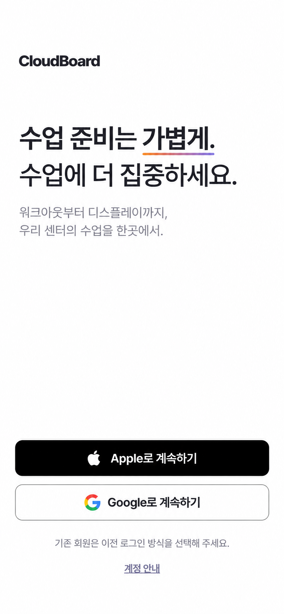
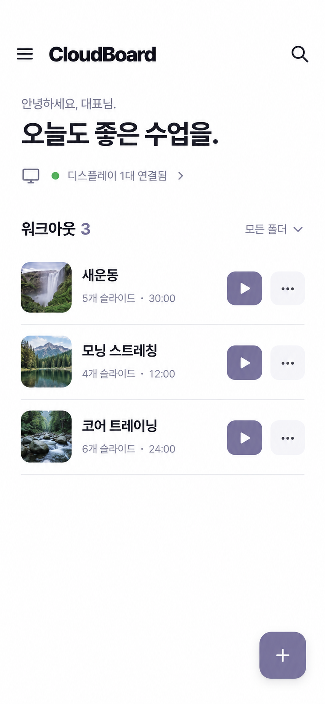
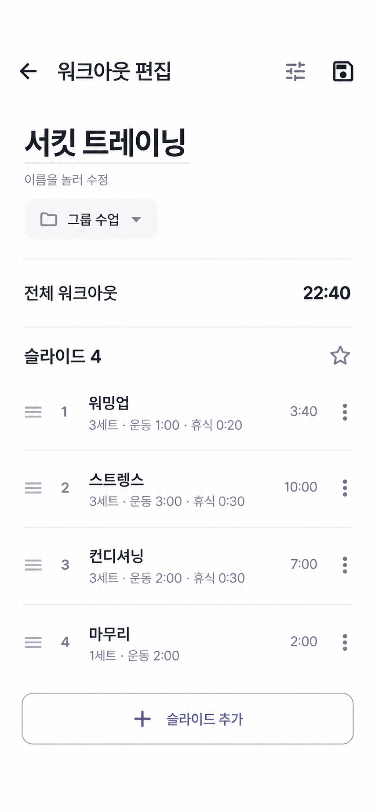
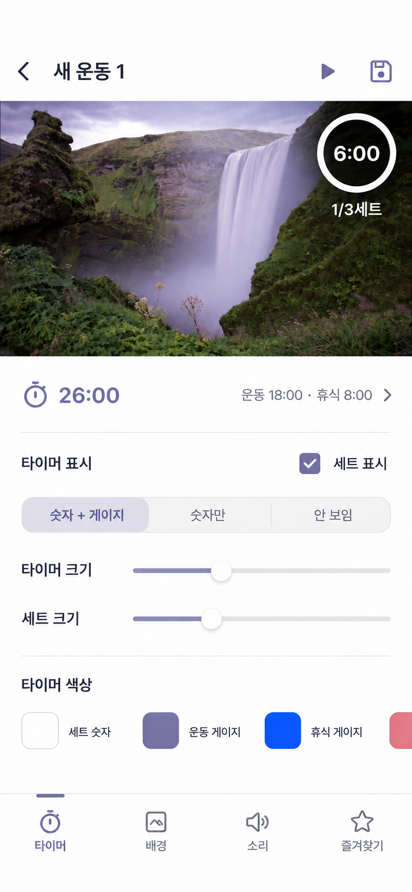
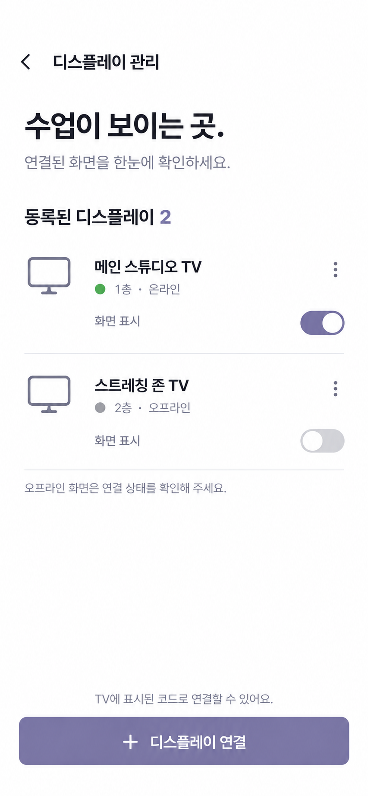
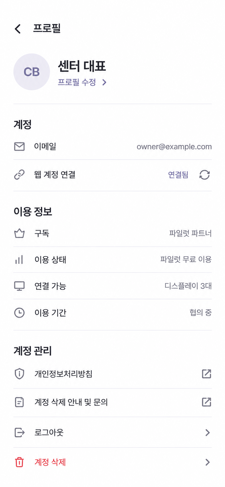
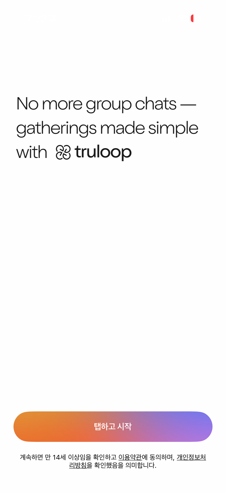

# CloudBoard 전체 12페이지 리디자인

STA-36과 STA-37을 **STA-36**으로 통합했습니다. 아래는 최초 6페이지 설계 기록이며, 최신 전체 설계와 검수 기준은 Linear STA-36에서 확인합니다.

## 시안 편하게 보기

- `cloudboard-design-gallery.html`: 이미지 12장을 포함한 단일 파일. 브라우저로 열면 서버 없이 사용할 수 있습니다.
- `gallery.html`: 같은 폴더의 PNG를 사용하는 가벼운 갤러리.
- 썸네일 클릭으로 확대, 좌우 키로 이동, 확대/축소와 개별 이미지 저장을 지원합니다.
- `../../../output/pdf/cloudboard-design-review.pdf`: 12페이지 PDF. Linear에도 첨부했습니다.

Linear: https://linear.app/clyrdev/issue/STA-36

## 목표

**수업 준비를 가볍게 만드는 생산성 도구**로 CloudBoard의 주요 페이지를 통일한다. 사용자가 제공한 truloop 레퍼런스의 흰 바탕, 큰 왼쪽 정렬 타이포, 절제된 포인트를 가져오되 실제 센터 운영 화면에서는 목록·상태·조작을 우선한다.

사용자가 이 방향으로 주요 페이지를 리디자인하는 데 동의했다. 이번 산출물은 **디자인 검토용 시안 6장과 상세 설계안**이며 앱 구현·인증·권한·결제 변경은 포함하지 않는다. 디자인 Backlog로 등록한다.

대상: 운동 센터 대표, 매니저, 코치. 핵심 여정: 로그인 → 워크아웃 선택/편집 → 디스플레이 확인 → 수업 시작 → 진행 제어.

## 디자인 원칙

- 흰 배경, 검정 타이포, 기존 라벤더 액션. 구분은 여백·정렬·타이포 → 얇은 구분선 → 필요한 부분만 옅은 면 순서로 한다.
- 로그인/온보딩에는 큰 메시지와 여유를, 매일 쓰는 운영 화면에는 짧은 제목과 적정 정보 밀도를 적용한다. 모든 페이지를 큰 여백의 랜딩 화면처럼 만들지 않는다.
- 오렌지→바이올렛 그라데이션은 환영 화면의 작은 브랜드 포인트에만 사용한다. 저장·재생·상태 색에는 적용하지 않는다.
- 큰 배경 카드와 중복 액션을 줄인다. 기능을 숨기기 위해 글자를 작게 만드는 방식은 피한다.
- 목록 제목 탭(편집), 재생, 더보기는 별도 터치 영역으로 구분한다.
- TV에 송출되는 이미지·타이머·센터 브랜드 색상은 사용자 콘텐츠이므로 관리 UI 테마로 덮어쓰지 않는다.

### 제안 토큰

기존 AppStyle/Pretendard를 출발점으로 한다. 아래 값은 디자인 검증용 제안이며 기존 공통 테마를 이번에 수정하지 않는다.

| 항목 | 제안 |
| --- | --- |
| 배경 / 주요 글자 | #FFFFFF / #202027 |
| 보조 글자 / 액션 | #72727E / #7E78A3 |
| 구분선 | #E6E6ED |
| 모바일 타이포 | 환영 제목 32–36, 운영 제목 24–28, 섹션 18–20, 본문 14–16 |
| 수평 여백 | 모바일 20–24, 좁은 화면 16 |
| 터치 영역 | 최소 48×48, 시각적 아이콘·슬라이더 손잡이와 별개 |
| 모서리 | 입력·버튼 12, 시트·팝업 24, 기존 우하단 FAB 유지 |
| 반응형 | iPad 홈 기존 3열 유지, 웹 최대 너비 1200 / 폼 660 유지 |

## 대표 페이지 6개

### 1. 로그인 — 메시지로 환영하기

큰 입체 일러스트 대신 왼쪽 정렬 메시지: **수업 준비는 가볍게. 수업에 더 집중하세요.**
보조 설명은 “워크아웃부터 디스플레이까지, 우리 센터의 수업을 한곳에서.”
Apple/Google 버튼과 기존 계정 안내를 유지한다. 제공자 버튼은 공식 자산·규격을 따르며 그라데이션으로 바꾸지 않는다. 인증 중·취소·실패·계정 불일치 안내를 설계한다.
1개월 체험은 STA-34의 준비된 정책과 자격 확인 이후 안내하며 로그인 자체를 체험 시작으로 오인시키지 않는다.

### 2. 홈 — 빠르게 훑는 워크아웃 목록

햄버거 / CloudBoard / 우측 검색 구조, 짧은 그리팅, 작은 연결 상태 행을 유지한다. 워크아웃은 썸네일·제목·슬라이드 수·시간·재생·더보기의 일반 목록으로 표현한다.
폴더는 목록 제목 옆 작은 선택기로, 추가는 우하단 FAB 한 곳으로 둔다. 큰 공통 수업 시작 카드나 중앙 직사각형 FAB를 다시 도입하지 않는다.
검색 종료 시 폴더·스크롤 복원, 0/1/다수 항목, 재생 중 미니 컨트롤러와 FAB 겹침을 설계한다.
그리팅은 1–2줄로 제한하고 워크아웃이 첫 화면에 보이도록 한다.

### 3. 워크아웃 편집 — 수업 순서가 중심

상단에 뒤로 / 제목 / 설정 / 저장. 이름은 본문에서 탭하면 다이얼로그로 수정하며 연필 아이콘을 복원하지 않는다.
전체 시간은 우측 정렬한다. 슬라이드는 큰 채움 카드 대신 드래그 핸들·순서·제목·요약·시간·메뉴가 있는 행으로 정리한다.
즐겨찾기 삽입은 별표로, 슬라이드 추가는 목록 끝 한 곳으로 둔다.
저장됨 문구·실행 취소/다시 실행 UI를 되살리지 않는다. 변경 없음은 저장 아이콘 비활성, 저장 중은 중복 조작 차단, 실패는 초안 유지와 재시도.
예시 수업은 3:40 + 10:00 + 7:00 + 2:00 = 22:40.

### 4. 슬라이드 편집 — 미리보기와 설정의 역할 분리

상단 이름 / 미리 재생 / 저장, 가로를 채우는 미리보기, 아래 설정, 하단 4개 섹션 탭(타이머·배경·소리·즐겨찾기).
하단 탭은 편집 화면 내부 섹션이며 홈의 전역 내비게이션으로 확장하지 않는다.
시간 요약 탭 → 타이머 바텀시트 → **적용**으로 초안 반영 → 상단 저장으로 최종 저장. 시트를 취소하면 이번 미적용 변경만 버린다.
세트 표시는 체크박스. 크기·세로 위치를 조정할 수 있고, 슬라이더 수치는 조작 중 노출한다. 손잡이 시각 크기는 줄여도 터치 영역은 유지한다.
색상은 작은 가로 스크롤 행, 라벨에서 반복되는 “색상” 제거, HEX는 상세 선택기에만 둔다.
좁거나 가로 화면에서는 미리보기 높이를 제한하고 설정이 스크롤되도록 한다.

### 5. 디스플레이 관리 — 연결과 화면 표시를 구분

장치명·공간·온라인/오프라인을 목록으로 표시하고 “화면 표시” 스위치와 상태를 분리한다. 색과 텍스트를 함께 사용한다.
이름 수정·화면 맞춤·연결 해제는 더보기로, 장치 연결은 단일 주요 액션으로 둔다.
연결 중·실패·오프라인·등록 0대·권한 제한·중복 연결 시나리오를 설계한다. 오프라인에서 명령을 받을 수 없으면 비활성 사유를 표시하고 실제 명령 정책과 맞춘다.
현재 기능은 코드/QR 연결 흐름에 맞춰 연결한다. 시안의 장치명과 연결 수는 샘플이다.

### 6. 프로필 — 가벼운 계정 페이지

바텀시트 대신 전체 페이지 유지. 작은 아바타와 이름·프로필 수정 진입을 같은 줄로 둔다.
계정 / 이용 정보 / 계정 관리 그룹을 흰 바탕과 구분선으로 나눈다. 이메일·웹 계정 연결·구독·이용 상태·연결 가능 수·기간은 실제 데이터를 표시한다.
프로필 수정도 별도 페이지. 로그아웃과 계정 삭제를 분리하고 삭제는 확인 절차 유지.
시안의 파일럿 파트너/3대/이메일은 기존 필드에 맞춘 예시이며 실제 플랜·체험 정책을 변경하지 않는다.

## 같은 체계를 확장할 나머지 페이지

| 페이지 | 리디자인 방향 / 유지할 동작 |
| --- | --- |
| 온보딩 | 한 단계에 한 주제, 짧은 질문과 선택 행. 센터 기본 정보 → 선택 환경 → 1개월 체험 확인 → 첫 수업 준비. 선택 항목 건너뛰기·중단 후 재개. 정책은 STA-34에서 관리 |
| 즐겨찾기 | 별표와 “즐겨찾기” 명칭 통일. 재사용 슬라이드의 썸네일·이름·시간 목록, 검색/필터와 삽입 동작 구분. 중복 드로워 목적지 생성 금지, 기존 전체 탐색 경로 보존 |
| 매장 운영 | 워크아웃 기본값·대기 화면·예약 재생·원격 관리·리포트 기존 기능 보존. 같은 목록/폼 규격으로 그룹화, 요약에서 상세로 이동, 미저장 상태 보존 |
| 수업 준비/진행 | 연결 대상과 수업 요약을 간결하게. 준비 카운트다운의 건너뛰기, 재생/일시정지·구간 이동·종료·미니 컨트롤러 유지. 운동/휴식은 색 외 텍스트도 제공 |
| TV/Display 모드 | 관리 UI와 별도 유지. 큰 타이머·세트·운동 제목의 거리 가독성과 기존 사용자 배경·색상 우선 |

이 표의 5개 화면군은 설계 방향을 정리했으며 이번 6장의 개별 이미지에는 포함하지 않았다. 상세 시안은 다음 디자인 단계에서 확장한다.

## 공통 상태와 검수 기준

- [ ] 6페이지에 동일 타이포·액션·행·시트·구분선 규칙 적용
- [ ] 320/390px 모바일, 모바일 가로, iPad 가로·세로, 웹에서 잘림 없이 동작
- [ ] 글꼴 확대 시 행 높이 증가와 줄바꿈, 안전 영역·키보드·하단 탭/FAB 겹침 검증
- [ ] 텍스트 대비와 접근성 이름·포커스·48px 터치 영역을 실제 UI에서 확인
- [ ] 빈 상태 / 로딩 / 오류·재시도 / 오프라인 / 권한 제한 상태 설계
- [ ] 미저장 이탈·저장 실패·중복 탭 및 적용/저장 구분 유지
- [ ] 드로워 닫힘 후 이동, 뒤로가기 시 깨끗한 홈과 기존 검색·스크롤 복원
- [ ] 기존 회원이 로그인 → 수업 찾기 → 연결 확인 → 시작을 막힘 없이 수행
- [ ] 신규 대표가 체험 안내 → 첫 워크아웃 미리보기까지 이해할 수 있는지 사용성 검토
- [ ] 디자이너가 실제 글꼴·아이콘·공식 로그인 자산·컴포넌트 규격으로 정리한 후 구현 범위 확정

## 이미지 해석 및 후속 구현

이미지는 Built-in ImageGen으로 제작한 분위기·정보 구조 검토용 시안이다. 폰/OS 프레임을 제외한 390×844 논리 화면을 목표로 생성했다. 정밀 치수·안전 영역·상태별 동작을 검증한 실행 앱은 아니다. 생성 이미지의 색상 샘플은 기본값 변경 지시가 아니며, 특히 타이머/배경은 실제 사용자 설정을 그대로 표시해야 한다.

추천 적용 순서: 공통 토큰·행 컴포넌트 → 홈/워크아웃 편집 → 슬라이드/타이머 → 디스플레이/프로필 → 로그인/온보딩. 각 단계에서 기존 기능 회귀 검증 후 다음 화면으로 확장한다.

관련 이슈 STA-33(홈), STA-34(온보딩·체험), STA-35(로그인)를 연결한다. 기존 이슈 상태·범위를 덮어쓰지 않고 본 이슈에서 시각적 통일 기준을 관리한다.

