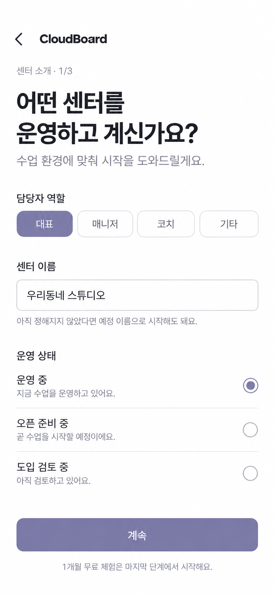
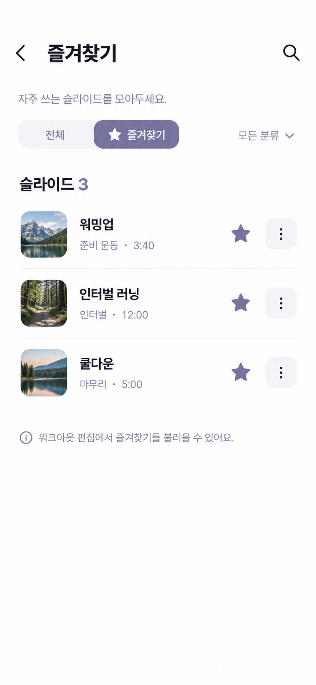
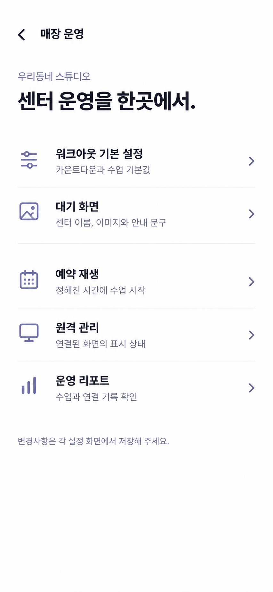
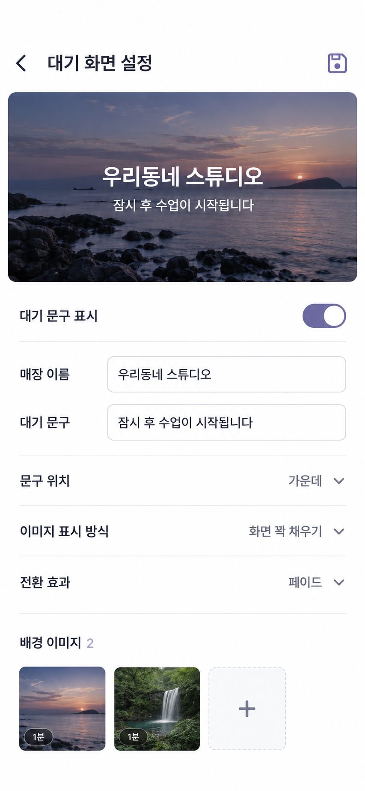
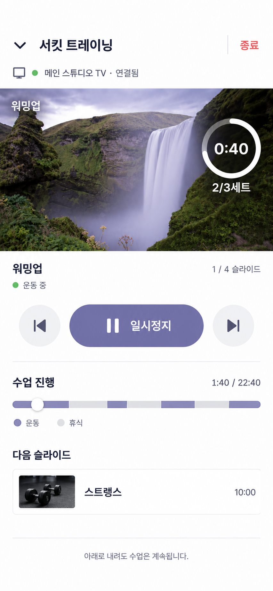
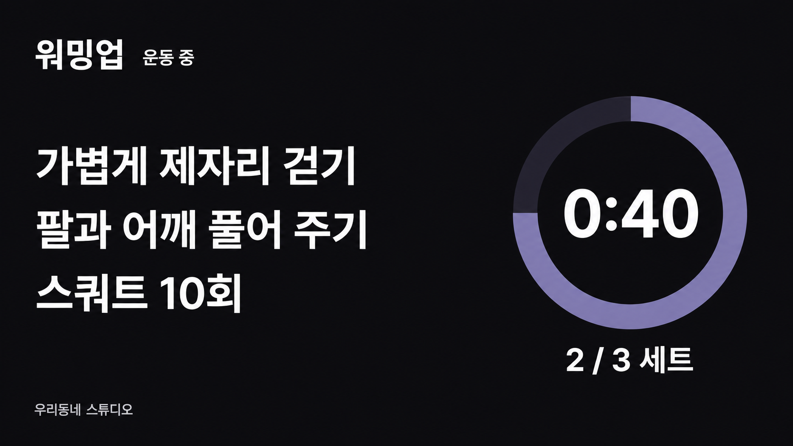

# CloudBoard 리디자인 확장

통합 Linear: https://linear.app/clyrdev/issue/STA-36

STA-37은 STA-36으로 통합하고 중복으로 정리했습니다. 아래 설계는 통합 이슈에 모두 반영되어 있습니다. 전체 12장 갤러리는 상위 폴더의 `cloudboard-design-gallery.html`을 브라우저로 열어 확인할 수 있습니다.

## 목적과 범위

STA-36의 **흰 배경·명확한 타이포·작은 라벤더 액션·목록 중심** 방향을 나머지 핵심 화면에 확장한다. 사용자가 앞선 시안의 분위기를 긍정적으로 평가하고 나머지 페이지도 리디자인해 Backlog로 등록하도록 요청했다.

이번 산출물: **온보딩, 즐겨찾기, 매장 운영, 대기 화면 설정, 수업 진행 컨트롤러, TV 송출 화면 — 대표 이미지 6장**과 하위 화면/상태 설계. 디자인 검토용이며 앱 코드·구독·인증·수업 동작을 변경하지 않는다.

기존 기능은 현재 라우터와 화면 코드에서 확인하고, 기존 캡처는 시각적 참고로 사용했다. 캡처는 최신 실행 앱 전체를 검수한 증거가 아니다. 그림 속 센터·슬라이드·장치·시간은 예시 데이터다.

## 1. 온보딩 — 한 단계에 한 주제

시안: 센터 소개 1/3. 역할, 센터 이름, 운영 상태를 먼저 받으며 큰 메시지와 단순 입력/선택 행을 사용한다.

제안 흐름:
1. **센터 소개**: 대표/매니저/코치/기타, 센터명, 운영 중/오픈 준비/도입 검토. 미정·예정 센터명 허용.
2. **수업 환경**: 센터 유형·지역 등 STA-34의 필수 항목과 선택 항목을 명확히 구분. 규모·공간·인원·기기 정보는 건너뛰거나 나중에 보완. 폼이 길면 같은 단계 안에서 짧은 화면으로 나눈다.
3. **체험 확인/첫 사용**: 1개월 체험의 대상·시작/종료 시점·제공 범위를 확인한 뒤 명시적으로 시작. 서버 권한 부여 성공 후 예시 워크아웃/디스플레이 연결로 안내.

보존 사항:
- 로그인만으로 체험을 자동 시작하지 않는다.
- 뒤로가기/중단 후 재개 시 입력 보존. 선택 정보 건너뛰기를 필수 정보 누락과 혼동하지 않는다.
- CTA는 키보드·작은 화면에서도 접근 가능, 검증 오류는 해당 입력 옆에 표시.
- STA-34가 수집 범위·1개월 정책의 기준이다. 카드 등록/자동 결제 여부 등 미확정 정책을 이번 이미지로 확정하지 않는다.
- “센터 소개 · 1/3”은 단계 체계 제안이며 필수 항목을 없애거나 개인정보 활용 목적을 추가하지 않는다.
- 이미지의 “마지막 단계에서 시작” 문구는 실제 정책 제공 준비 후 적용. 실제로는 확인 후 시작 버튼을 누른 경우에만 시작한다.

## 2. 즐겨찾기 — 관리와 삽입 구분

제목·별표를 **즐겨찾기**로 통일하고 내부에 전체/즐겨찾기 필터를 두어 기존 라이브러리 전체 탐색도 보존한다. 작은 썸네일, 슬라이드명, 분류·총 시간, 별표, 더보기의 행으로 구성한다.

- 독립 관리 화면: 이름·분류 수정, 복제, 삭제, 즐겨찾기 토글.
- 워크아웃 편집에서 진입한 삽입 모드: 대상 워크아웃 문맥을 표시하고 행별 삽입 동작 제공. 성공 피드백, 중복 탭 방지, 삽입 후 복귀/추가 삽입 정책 정의.
- 검색 액션은 이름/분류 범위를 안내. 결과 없음·필터 해제·재시도 상태 포함. 검색은 상세 구현 범위를 검토할 제안이다.
- 별표 해제는 원본 삭제가 아니다. 삭제는 별도 확인과 영향 안내.
- 드로워에 즐겨찾기/라이브러리를 중복 생성하지 않는다.
- 빈 상태는 “자주 쓰는 슬라이드를 저장해 보세요” + 워크아웃 편집에서 저장하는 경로 안내.
- 이름이 길어도 별표/더보기/삽입 터치 영역이 겹치지 않도록 줄바꿈.

## 3. 매장 운영 — 다섯 목적지를 명확하게

기존 5개 탭 기능을 **워크아웃 기본 설정 / 대기 화면 / 예약 재생 / 원격 관리 / 운영 리포트**의 목록형 시작 페이지로 정리하는 제안이다. 기능 삭제가 아니라 진입 구조 변경이며, 상세 화면으로 한 단계 더 들어가는 비용과 현재 탭 전환 빈도를 비교해 확정한다.

하위 화면 설계:
- **워크아웃 기본 설정**: 카운트다운·사운드 등 기존 기본값을 섹션별 짧은 폼으로. 적용 범위(새 워크아웃/기존 수업 등)는 현재 도메인 규칙을 안내하며 임의 변경 금지.
- **예약 재생**: 워크아웃명·시간·반복·사용 여부가 있는 목록, 추가/수정 화면. 시간대·반복 요일·충돌·권한 제한·실행 실패의 상태 표현. 캘린더 장식이나 가상 매출 지표를 추가하지 않는다.
- **원격 관리**: 실제 장치의 온라인 상태와 자동/대기/검은 화면 명령 구분. 전송 중/성공/실패가 섞이지 않게 행별 표시. 실제 응답 전 성공 표시 금지.
- **운영 리포트**: 현재 제공하는 수업/연결 기록과 집계 범위 유지. 기간·단위를 명확히 하고 빈 데이터와 로딩을 0으로 오인시키지 않는다. 가짜 지표/차트 추가 금지.
- 각 상세 페이지는 뒤로가기·명확한 제목·필요할 때 우측 저장을 공유. 검색·스크롤·미저장 초안 복원.
- 태블릿/웹은 왼쪽 섹션 목록+오른쪽 상세를 검토해 왕복을 줄인다.

## 4. 대기 화면 설정 — 실제 송출 결과를 먼저

16:9 미리보기 아래 매장 이름·문구·문구 표시·위치·이미지 맞춤·전환 효과·이미지 목록을 간결한 폼으로 구성한다. 상단 저장 하나로 통일하는 제안.

- 기존 이미지 전체 배경 옵션, 문구 색상/크기 등 시안 첫 화면에 없는 설정도 삭제하지 않고 상세 영역/스크롤로 제공.
- 미리보기는 실제 사용자 이미지·로고·문구 반영. 이미지 업로드/실패/삭제/재정렬/표시 시간 설정 유지.
- “전체 보기”와 “화면 꽉 채우기”의 잘림 차이를 미리보기에서 확인.
- 이미지별 시간과 전환 효과의 영향 구분, 미리보기 애니메이션은 동작 줄이기 설정 존중.
- 저장 실패 시 입력·이미지 순서 보존, 취소 시 저장 기준으로 복원.
- 시안의 배경 2장/각 1분은 샘플. 기존 설정 모델에 없는 신규 필드는 이 이슈에서 도입하지 않는다.

## 5. 수업 진행 — 핵심 조작에 집중

연결 대상 → 실제 수업 미리보기 → 현재 슬라이드/운동·휴식 상태 → 큰 재생/일시정지와 이전/다음 → 전체 진행 막대 → 다음 슬라이드 순서로 구성한다.

- 최소화는 좌상단, 종료는 우상단으로 분리. 종료 확인을 유지하고 최소화 후 미니 컨트롤러로 복귀 가능.
- 준비 카운트다운 상태: 기존 준비 시간·슬라이드명과 **건너뛰기**. 컨트롤러에서만 명령 가능, TV 관람 화면에 스킵 버튼 노출 금지.
- 타임라인의 운동/휴식 색상+범례, 현재 위치, 드래그 시 이동 대상/시간 미리보기 유지.
- 이미지 속 진행 막대 구간 너비와 링 비율은 생성 이미지의 예시다. 구현은 실제 구간 길이와 현재 타임스탬프로 정확하게 계산해야 한다.
- 일시정지 중 구간 이동은 일시정지를 유지. 명령 중 중복 탭, 연결 끊김, 복구 중·실패·완료 상태 설계.
- 수업 중 편집 금지 및 로컬 재생/연결 재생 권한 차이 유지.
- 시안의 “아래로 내려도” 안내는 제스처가 실제 지원될 때만 사용. 상단 최소화만 지원하면 “최소화해도 수업은 계속됩니다”로 바꾼다.
- 휴대폰 가로/iPad는 미리보기와 제어를 나란히 배치하는 안을 검토하되 핵심 버튼의 접근성 유지.

## 6. TV 송출 — 거리 가독성 우선

관리 화면의 목록 스타일을 TV에 그대로 복제하지 않는다. 시안은 **검정 배경의 사용자 슬라이드 예시**로, 큰 운동 안내·큰 타이머·읽기 쉬운 세트·센터명을 정렬한 16:9 화면이다.

- 사용자 배경·운동/휴식 색·타이머 표시 방식·위치·세트 크기·센터 브랜드 설정을 그대로 존중한다. 일괄 검정 테마로 강제 변경하지 않는다.
- TV는 조작 버튼·관리 메뉴 없는 관람 화면. 컨트롤러의 제어 권한과 명확히 분리.
- 16:9 전체화면의 가장자리 안전 여백, 실제 설치 거리·대비·긴 제목/본문 검증.
- 준비/운동/휴식/일시정지/완료/연결 대기를 텍스트와 시각 요소로 구분. 기존 진행 중 재연결 정책 유지.
- 준비 완료 화면은 장치 식별·연결 대기·필요한 사운드 활성화만 명확하게. 코드/QR은 연결 전 상태에만.
- 이미지의 센터명은 텍스트 예시이며 센터 로고 송출 신규 기능은 STA-17 범위와 조율.

## 보조 화면·상태에 적용할 공통 규칙

이번 대표 이미지 외 세부 흐름도 아래 기준으로 확장한다.

| 화면 | 설계 |
| --- | --- |
| 프로필 수정 | 전체 페이지, 아바타 변경·이름 입력·이메일 읽기 전용·저장, 실패 시 초안 유지 |
| 타이머 시트 | 핸들/닫기/제목/적용, 시간·세트 블록, 미적용 취소 확인. 적용→슬라이드 저장 구분 유지 |
| 장치 연결·QR 스캐너 | 카메라 안내·권한 거부·코드 입력 대안·코드 만료/잘못된 코드·연결 진행/성공/실패 |
| 워크아웃/슬라이드 이름 수정 | 한 입력 다이얼로그, 현재 이름 선택·빈 값 검증·취소/적용 |
| 폴더 선택/추가 | 작은 선택 목록과 추가 진입, 현재 선택 표시·긴 이름/중복 처리 |
| 이미지/색상 선택기 | 현재 값과 미리보기, 선택·취소 의미 통일, 색상 텍스트 입력 검증 |
| 체험 확인/만료·권한 제한 | 실제 권한에 근거한 혜택·정확한 기간·다음 행동, 진행 중 수업 정책은 STA-34 기준 |
| 인증/권한 오류·로딩 | 작업별 짧은 안내·재시도·기존 입력 보존, 빈 화면/무한 로딩 방지 |

## 완료 기준

- [ ] STA-36과 같은 타이포/행/입력/액션 규칙으로 연결
- [ ] 기존 기능과 전체 라이브러리 접근 보존, 별표 명칭·동작 통일
- [ ] 온보딩 필수/선택·건너뛰기·재개·명시적 체험 시작 검토
- [ ] 매장 운영 목록형 진입과 기존 탭형의 탐색 비용 비교 후 채택안 확정
- [ ] 수업 최소화/종료·카운트다운 스킵·구간 이동·일시정지·재연결 상태 검토
- [ ] 관리 UI와 TV 사용자 콘텐츠 테마 분리
- [ ] 320/390px, 가로, iPad, 웹, 글꼴 확대·키보드·안전 영역·최소 48px 터치 영역 검증
- [ ] 온라인/오프라인·로딩·빈 상태·오류/재시도·권한 제한·저장 실패 설계
- [ ] 생성 이미지를 실제 글꼴·아이콘·컴포넌트·데이터로 옮길 때 가독성과 동작 검증

제작: Built-in ImageGen. 모바일 5장은 390×844 논리 화면, TV 1장은 1920×1080 비율을 목표로 했다. 이는 구현 완료나 실제 UI 테스트 결과가 아니다. 실제 생성 픽셀 크기와 논리 목표 크기는 다를 수 있다.

관련: STA-36(기본 6페이지/공통 디자인), STA-34(온보딩/체험), STA-33(홈/내비게이션), STA-17(센터 로고).

