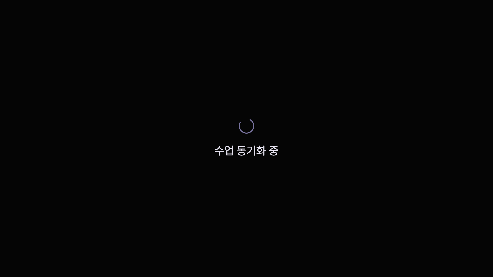
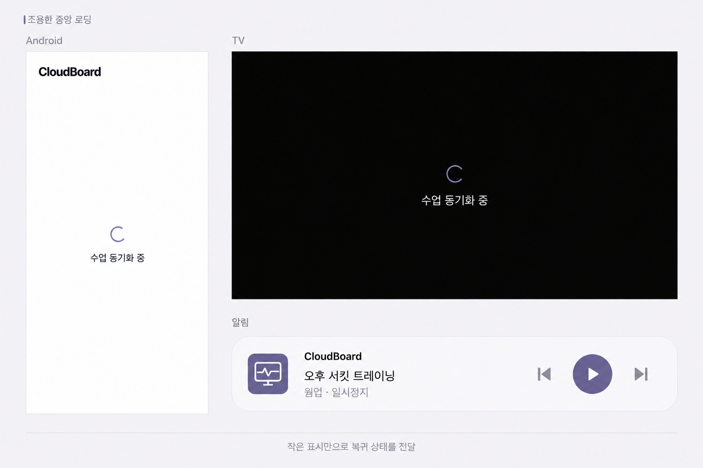
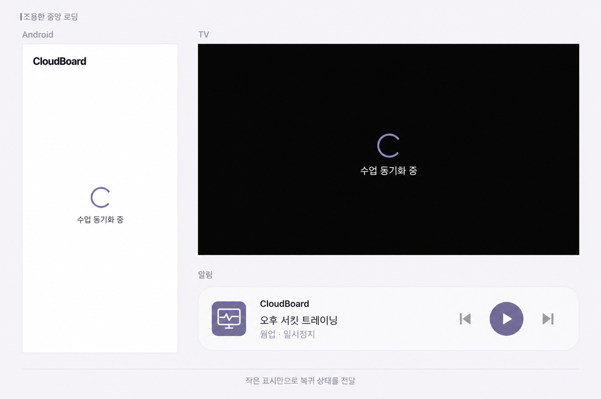
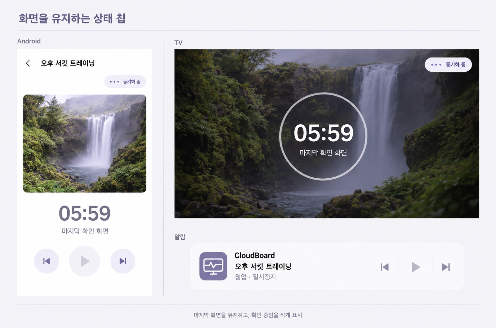
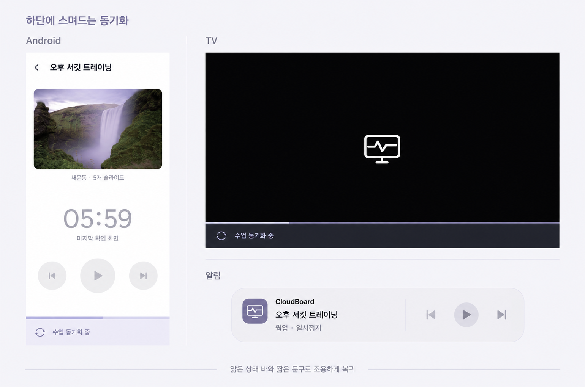

# CloudBoard Android·TV 복귀 동기화 리디자인

- 날짜: 2026-10-01 (Asia/Seoul)
- Linear: [STA-54](https://linear.app/clyrdev/issue/STA-54)
- 상태: develop 구현 및 자동 검증 완료 · 실기기 QA 대기.
- 선택: 최초 대화의 1번, 스피너를 더 작고 얇게 수정.
- 제작: built-in image_gen. [전체 프롬프트](prompts.md).

## 실제 구현 렌더

실제 Flutter 위젯을 렌더링한 이미지이며 실기기 캡처는 아니다. [검증 보고서](design-qa.md).

[Android 오류](evidence/android-error.png) · [가로/큰 글꼴](evidence/android-landscape-large-text.png) · [TV 오류](evidence/tv-error.png) · [TV 4K](evidence/tv-4k.png)

## 선택 방향 · 수정본

## 최초 시안 3개

### 1번

### 2번

### 3번

## 보존한 자료

[Linear 개발 명세](linear-issue.md) · [사용자 제보 화면](reference-broken-resume.png) · [사용자 제보 알림](reference-notification.png)

모든 이미지를 Linear에 PNG 원본으로 첨부하고 본문에 세로로 나열했다. 알림 레이아웃은 OS/제조사 제약을 받는 디자인 의도다.
