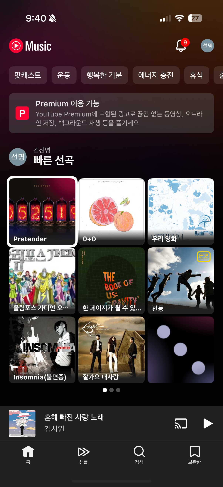
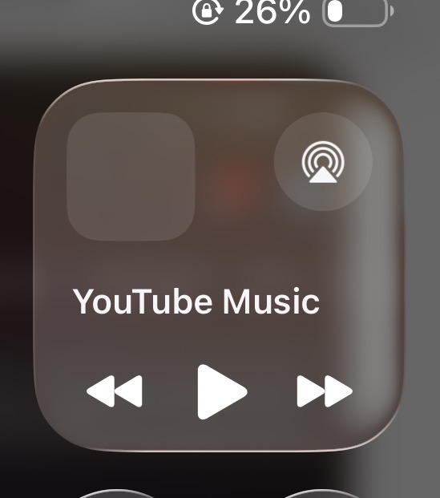

# 2026-09-17 매장 파일럿 피드백 분석

- 대상: 클라우드보드의 컨트롤러 앱과 연결 디스플레이
- 분석 기준: `develop`, `6accb98`의 현재 소스
- 추가 반영: 최소화 참고 이미지와 태블릿 OS 제어 기능(08) 검토.
- 상태: **Linear CLY-5~CLY-12 등록 및 develop 구현 진행. 아래는 구현 전 분석 기록이며, 현재 반영/검증 상태는 [구현 기록](pilot-feedback-2026-09-17/implementation.md)을 따른다.**
- 근거 범위: 운영자 제보, 현재 코드, Android·Firebase 공식 문서. 현장 기기 로그·실제 DB 기록·당시 설치 빌드는 확인하지 않았다.
- 용어: **슬라이드**는 이미지·타이머 설정을 가진 콘텐츠 한 장, **운동 단계**는 해당 슬라이드 안의 운동/휴식·세트 구간이다. 둘의 이동 동작은 구분한다.

## 1. 핵심 판단

이번 피드백의 중심은 디자인보다 **수업 재생과 컨트롤러 화면의 독립성**이다. 컨트롤러가 다른 화면을 보거나 잠겨도 디스플레이의 수업은 같은 타임라인으로 계속 진행돼야 한다.

현재 앱에는 이미 Android 알림을 통한 백그라운드 제어가 있다. 따라서 화면 꺼짐 문제를 ‘백그라운드 기능이 없어서 발생했다’고 단정할 수 없다. **재생 위치 복구, 여러 컨트롤러의 자동 상태 갱신, 재연결 후 지연 명령 처리**를 우선 조사해야 한다.

| 번호 | 제보를 앱 동작으로 정리 | 코드상 판단 | 우선순위 |
| --- | --- | --- | --- |
| 1 | 연결 수업 중 컨트롤러에서 효과음 중복 출력 | 컨트롤러/디스플레이 역할을 구분하지 않는 효과음 호출 확인 | P1 |
| 2 | 같은 계정의 컨트롤러가 재생 화면에 묶임 | 활성 수업이 있으면 홈을 플레이어로 대체하는 구조 확인 | P1 |
| 3 | Android 태블릿 화면 꺼짐 후 디스플레이 연결 끊김 안내 + 슬라이드 되감김 | 연결 경고 발생은 사용자 확인 사실. 실제 단절 지점과 되감김의 연관 원인은 로그 확인 필요 | **P0** |
| 4 | 타이머 효과음이 날카롭고 거슬림 | 합성 비프음과 고주파 배음이 있는 기본 시작음 확인. 청감 원인은 미확정 | P2 |
| 5 | 진행 막대 터치·드래그로 이동하고 싶음 | 진행 막대는 표시 전용. 하단 점 버튼의 슬라이드 선택은 이미 지원 | P2 |
| 6 | 일시정지 중 다른 슬라이드로 이동하면 재생됨 | Flutter와 Android 알림 양쪽의 강제 재생 전환 확인 | P1 |
| 7 | 등록하지 않은 디스플레이가 목록에 나타남 | 구형 코드 발급 경로가 등록 전 기기 레코드를 만들고, 목록이 미등록을 걸러내지 않음 | P1 |
| 8 | 태블릿의 제어 센터/알림창에서 수업 조작 | 추가 기능 검토. Android 일반 알림은 존재하며 iPad 미디어 카드와 별도 Controls의 적합성 비교 필요 | P2 |

P0: 수업 지속성 문제로 다른 매장 파일럿 확대 전 해결·실기기 검증 필요. P1: 현장 운영에 직접 영향을 주는 개선. P2: 조작 편의와 품질 개선. 여기서 사용한 번호는 문서 내 번호이며 Linear 이슈 ID가 아니다.

## 2. 항목별 분석

### 01. 연결 수업에서는 컨트롤러 효과음을 기본 무음으로

**발생 상황**

TV/디스플레이에서 수업을 재생하는 동시에 컨트롤러 태블릿·휴대폰에서도 효과음이 나온다. 컨트롤러가 Bluetooth 스피커에 연결돼 있으면 디스플레이의 소리와 시차를 두고 겹쳐 들릴 수 있다.

**확인한 코드**

- `PlayerController._play()`는 플레이어 역할과 관계없이 `BeepPlayer.play()`를 호출한다.
- `canControl`은 명령 권한을 구분하지만 효과음 출력 여부는 구분하지 않는다.
- 재생 화면에서 컨트롤러와 디스플레이 모두 같은 플레이어 로직을 사용한다. 같은 수업을 연 컨트롤러가 여러 대면 출력도 늘어날 수 있다.
- `BeepPlayer`에는 다른 오디오를 일시적으로 줄이는 audio focus/duck 설정도 있다. 단순히 볼륨만 0으로 만드는 방식보다 제어용 기기에서 효과음 호출 자체를 생략하는 것이 명확하다.

**권장 동작**

| 상황 | 효과음 정책 |
| --- | --- |
| 연결 디스플레이 수업을 조작하는 컨트롤러 | 기본 무음 |
| 수업을 실제 표시하는 디스플레이 | 기존 워크아웃 사운드 설정 적용 |
| 연결 수업과 무관한 로컬 시험 재생·소리 미리듣기 | 기존 효과음 유지 |
| 연결이 잠시 끊긴 컨트롤러 | 자동으로 유음 전환하지 않음 |

기기 전체 미디어 볼륨이나 Bluetooth 연결은 변경하지 않는다. 컨트롤러를 음악 재생용으로도 쓰는 매장의 음악을 끄면 안 된다. 여러 디스플레이 자체의 소리 중복은 별도 문제이며, 필요하면 후속으로 ‘효과음을 출력할 디스플레이’ 선택을 검토한다.

**완료 기준**

- [ ] 디스플레이 1대 + 컨트롤러 2대에서 카운트다운·운동 시작·휴식 시작·종료음이 컨트롤러에서 나오지 않는다.
- [ ] 컨트롤러에 연결한 Bluetooth 스피커의 기존 음악이 제어 동작 때문에 중단되거나 작아지지 않는다.
- [ ] 로컬 시험 재생과 사운드 설정의 미리듣기는 정상 동작한다.
- [ ] Android와 iOS를 각각 확인한다. iOS의 기존 무음 오디오 유지 경로는 실제 효과음과 별도로 검토한다.

### 02. 재생 화면 최소화와 하단 미니 컨트롤

**발생 상황**

같은 계정으로 사용하는 여러 컨트롤러가 활성 수업을 발견하면 전체 재생 화면을 보여준다. 수업을 유지하면서 홈·워크아웃·프로필 등 다른 화면을 보기 어렵다.

**확인한 코드**

- `DeviceModeHomeScreen`은 미완료 활성 세션이 있으면 `WorkoutListScreen` 대신 `WorkoutPlayerScreen`을 반환한다.
- `WorkoutPlayerScreen`의 뒤로가기는 수업 종료 확인에 연결돼 있다. 현재 구조에서 화면 닫기와 수업 종료가 결합돼 있다.
- `WorkoutControlPanel`에는 종료 버튼이 있지만 최소화 상태가 없다.

**권장 동작**

1. 전체 조작 화면에 ‘최소화’를 추가한다. ‘수업 종료’는 별도로 유지한다.
2. 최소화하면 이전 화면 또는 홈을 보여주고 하단에 미니 컨트롤 바를 표시한다.
3. 미니 바에는 수업명, 현재 슬라이드/운동·휴식, 일시정지·재개, 전체 화면 복귀를 제공한다. 종료는 오조작을 피하도록 전체 화면 또는 추가 메뉴에 둔다.
4. 다른 컨트롤러는 활성 수업을 감지해도 전체 화면으로 강제 이동하지 않고 미니 바로 진입점을 제공한다. 수업 시작을 누른 기기만 전체 조작 화면을 연다.
5. 최소화 여부는 **각 기기의 로컬 UI 상태**다. 한 기기가 최소화해도 다른 기기의 화면과 수업 상태는 바뀌지 않는다.
6. 기존 수업 중 새 수업 시작은 별도의 충돌 정책을 유지한다. 최소화가 중복 세션 시작 허용을 뜻하지 않는다.

재생 세션·명령 처리의 수명은 전체 화면 위젯과 분리해야 한다. 단순히 화면을 `pop`하면 현재 종료 처리나 provider 해제가 실행될 수 있으므로 UI 버튼 추가만으로 끝내면 안 된다. 재생 중인 세션의 워크아웃 스냅샷과 다른 화면에서 편집하는 초안도 분리한다.

**제공된 참고 이미지 반영**

첫 이미지의 하단 미니 플레이어처럼 **다른 화면을 탐색하는 동안 하단에 수업 조작 바가 남는 형태**로 방향을 확정한다. YouTube Music의 색상·전체 화면·하단 탭 구성을 복제하는 요청은 아니며, 클라우드보드의 기존 테마와 내비게이션을 유지한다.

- 왼쪽: 현재 슬라이드의 작은 썸네일. 이미지가 없으면 기본 아이콘.
- 가운데: 수업명 + 현재 슬라이드/운동·휴식 상태와 남은 시간.
- 오른쪽: 일시정지·재개. 태블릿처럼 충분한 폭에서는 다음 슬라이드 버튼을 추가하는 안을 검토한다.
- 썸네일·제목 영역을 누르면 전체 조작 화면으로 복귀한다. 재생 버튼을 누르는 동작과 분리한다.
- 바는 스크롤과 무관하게 앱 하단에 고정하고, 화면 콘텐츠가 가려지지 않도록 하단 공간을 확보한다. 키보드·시트·다이얼로그가 열릴 때도 가림과 터치 충돌이 없어야 한다.
- 참고 이미지의 Cast 아이콘은 새 전송 기능 요구로 간주하지 않는다. 클라우드보드의 기존 연결 디스플레이 정보와 구분한다.
- 이 미니 바는 **앱 내부 기능**이다. 앱을 홈 화면으로 내렸을 때 나타나는 제어 센터/알림은 08의 별도 기능이다.

**완료 기준**

- [ ] 수업 중 홈·편집·프로필·디스플레이 설정을 열고 돌아와도 위치와 정지 상태가 유지된다.
- [ ] 최소화·복귀에서 종료 명령, 새 세션 생성, 카운트다운 재시작이 발생하지 않는다.
- [ ] 컨트롤러 두 대에서 최소화 여부가 독립적이다.
- [ ] 다른 기기에서 종료하면 미니 바도 정리되고 이전 세션의 버튼이 동작하지 않는다.
- [ ] 미니 바가 FAB·저장 버튼·키보드 내림 바·바텀시트를 가리지 않는다.

### 03. Android 화면 꺼짐 후 디스플레이 연결 끊김 안내와 슬라이드 초기화

**사용자가 재확인한 발생 상황**

Android 태블릿으로 수업을 제어하던 중 **화면이 꺼진 뒤 ‘디스플레이 연결이 끊겼다’는 의미의 안내가 실제로 표시됐고, 운동 중 슬라이드가 처음으로 돌아갔다.** 연결 경고는 추측이나 추가 확인이 필요한 제보가 아니라, 사용자가 확인한 핵심 증상이다. ‘타이머만 초기화된 문제’로 축소하지 않는다.

화면 꺼짐 → 연결 끊김 안내 및 재생 위치 이상을 **하나의 현장 사고**로 묶어 조사한다. 두 증상의 정확한 발생 순서와 인과관계까지 확인됐다는 뜻은 아니다.

다음은 경고의 발생 여부가 아니라 **원인 범위를 좁히기 위해** 구분할 사항이다.

- 실제 TV 화면도 되감겼는지, 컨트롤러 표시만 되감겼는지.
- 수업의 첫 슬라이드인지, 현재 슬라이드의 시작 시점인지.
- 발생한 앱 versionCode, Android 버전·기종, 잠금 시간, Wi-Fi/절전 상태, 다른 컨트롤러 수.

**이미 구현된 기능**

`android_class_notifications.dart`와 `ClassNotifications.kt`에는 앱 범위의 일반 알림과 네이티브 명령 처리 경로가 있다. 명령은 Flutter 재생 화면 없이 Firebase 세션을 조회·검증한 뒤 전송한다. Android에서 무음 오디오나 상시 foreground service로 수업을 유지하는 구조는 아니다.

`resolvePlaybackPosition()`도 서버 기준 시각과 남은 시간을 사용해 잠금 동안 지나간 운동 단계를 계산한다. 따라서 ‘백그라운드 기능 없음’ 또는 ‘시간 계산 없음’으로 원인을 확정하면 안 된다.

**연결 끊김 안내부터 추적할 지점**

현재 컨트롤 화면에는 `sessionId != null && !isConnected`일 때 **‘연결이 끊겼습니다. 디스플레이 상태를 확인해 주세요.’**를 표시하는 코드가 있다. 여기서 `isConnected`는 그 컨트롤러 기기의 Firebase `/.info/connected` 값이다. 디스플레이의 `online` 값이나 ACK로 결정하지 않는다.

따라서 사용자가 디스플레이 연결 끊김 안내를 본 것은 현재 UI와 부합한다. 다만 이 문구만으로 **TV의 네트워크까지 실제로 끊겼다**고 확정할 수는 없다. 컨트롤러 연결 단절, 디스플레이 연결 단절, 양쪽 단절을 기록으로 구분해야 한다. 반대로 단순 안내 오류라고 결론 내리고 문구만 수정해서도 안 된다. 슬라이드 되감김을 함께 해결해야 한다.

**코드에서 확인한 조사 지점**

| 조사 지점 | 확인된 사실 | 검증할 가설 |
| --- | --- | --- |
| 자동 운동 단계 갱신 | `PlayerController._tick()`은 제어 가능한 원격 플레이어에서 단계 전환마다 `syncStep()`을 호출한다 | 여러 컨트롤러가 동시에 갱신하거나, 오래된 기기의 갱신이 최신 위치를 덮어쓰는지 |
| 원격 업데이트 | transaction은 세션 ID·완료 상태를 검사하지만 기대 revision/명령 만료 검사를 동일하게 받지는 않는다 | 같은 세션 안에서 지연된 단계 명령이 나중에 반영되는지 |
| 앱 내 명령 시간 초과 | `PlaybackRepositoryImpl._update()`는 로컬을 먼저 변경하고, 서버 요청의 2초 timeout을 잡아 정상 반환한다 | 성공처럼 보인 미확인 명령 또는 대기 중 쓰기가 복구 후 위치를 바꾸는지 |
| 세션 복구 | 캐시를 먼저 읽고 원격 이벤트를 적용한다. 플레이어는 세션·서버 시각 provider 변경에 따라 다시 계산한다 | 캐시·원격 스냅샷·시각 보정 순서가 바뀔 때 잘못된 초기 상태나 anchor를 적용하는지 |
| 연결 안내 | 컨트롤 화면 경고의 기준은 해당 앱의 `/.info/connected`이다 | 컨트롤러의 서버 연결 끊김을 TV 연결 끊김처럼 안내하는지 |

이들은 **원인 후보**다. 현장 로그 없이 특정 경로를 이번 사고의 확정 원인으로 표시하지 않는다. Firebase의 `/.info/connected`는 조회 중인 클라이언트의 접속 상태이며 TV의 접속 상태를 대신하지 않는다. 오프라인 쓰기는 재연결 후 전달될 수 있다. [Firebase 오프라인 동작](https://firebase.google.com/docs/database/flutter/offline-capabilities)

**권장 해결 방향**

- 수업 진행의 기준은 서버가 확정한 세션 타임라인이다. 컨트롤러가 잠겨도 디스플레이는 이미 받은 스냅샷·시간 기준으로 진행해야 한다.
- 모든 컨트롤러가 운동 경계마다 자동 쓰기를 경쟁하는 구조를 줄인다. 우선 각 화면은 공통 타임라인을 읽어 계산하고, 명시적인 정지·재개·이동 명령만 상태를 바꾸는 방향을 검토한다. 자연 종료의 영속화 주체와 중복 처리도 함께 설계한다.
- 명령에 세션 ID, 기대 revision, 고유 명령 ID, 만료 시각을 일관되게 적용한다. transaction은 최신 revision을 다시 읽었다는 이유만으로 오래된 사용자의 의도를 재실행하면 안 된다.
- 앱 내 명령과 Android 알림 명령의 성공·실패·충돌 정책을 맞춘다. timeout은 성공이 아니라 ‘결과 확인 중’ 또는 실패/재동기화 대상으로 처리한다.
- 복귀 시 로컬의 오래된 위치를 먼저 서버에 쓰지 말고, 최신 세션을 확인해 화면을 맞춘다. 잠금 전 세션이 끝났다면 복원하지 않는다.
- ‘컨트롤러 연결 확인 중’, ‘명령 전달 실패’, ‘디스플레이 응답 확인 필요’를 구분한다. 디스플레이별 `currentSessionId`·`acknowledgedRevision`·접속 상태를 참고하되, 현재 ACK는 화면에서 세션을 관찰한 사실이지 실제 영상·음향 출력 완료 보장은 아니다.
- 잠금 중 조작은 기존 Android 알림 경로를 보강한다. 상시 서비스 추가나 배터리 최적화 해제를 일차 해결책으로 삼지 않는다. Android는 잠금 후 유휴 상태에서 네트워크·백그라운드 실행을 제한할 수 있으므로 별도 실기기 검증이 필요하다. [Android Doze·App Standby](https://developer.android.com/training/monitoring-device-state/doze-standby)

**연결 단절 재현을 나눠서 확인**

| 조건 | 확인할 사실 |
| --- | --- |
| 디스플레이는 계속 온라인, 컨트롤러 태블릿만 잠금 | 컨트롤러의 Firebase 연결 변화, 경고 시각, 디스플레이가 계속 재생하는지 |
| 컨트롤러는 온라인, 디스플레이만 네트워크 단절 | 실제 디스플레이 online/ACK 변화가 화면에 정확히 반영되는지 |
| 양쪽 네트워크 단절 후 순서대로 복구 | 경고가 올바르게 해소되는지, 이전 위치·지연 명령이 수업을 되감는지 |

**진단에 필요한 기록**

사건 시각, 앱 버전/빌드, Android 기종·OS, 컨트롤러/디스플레이 역할, 익명화된 세션·기기 식별자, 잠금/복귀 시각, 서버 연결 변화, 세션 revision·상태·단계·remainingMs·anchorServerMs·updatedByDeviceId, 명령 생성/전송/응답 시각, 대상 디스플레이의 ACK를 함께 비교한다. 인증 토큰·이메일·페어링 코드를 로그에 남기지 않는다. Crashlytics의 크래시 유무만으로 재생 상태 오류를 판별하지 않는다.

**완료 기준**

- [ ] 실제 Android 태블릿 + 디스플레이에서 잠금 30초·5분·15분 후에도 수업이 정상 경과 위치에 있다.
- [ ] 제보된 디스플레이 연결 끊김 안내의 발생 조건을 재현하고, 실제 단절 기기와 UI 안내가 일치한다. 연결 복구 후 경고가 해소되며 슬라이드가 초기화되지 않는다.
- [ ] 잠금 동안 여러 운동/휴식 단계를 지나도 처음으로 돌아가지 않는다.
- [ ] 컨트롤러 2대 중 한 대를 잠그고 다른 기기로 이동·정지한 후 깨워도 오래된 위치가 적용되지 않는다.
- [ ] 일시정지 상태에서는 잠금·복귀 후 남은 시간이 그대로다.
- [ ] Wi-Fi 단절·복구 및 timeout 뒤 오래된 명령이 실행되지 않고 성공 표시가 정직하다.
- [ ] 앱 프로세스 재시작 시 진행/종료 여부를 정확히 복구한다. 사용자가 앱을 강제 종료한 뒤에도 알림 제어가 보장된다고 안내하지 않는다.
- [ ] Android 알림 권한 거부, Android 13·14 이상 및 현장 태블릿의 절전 조건을 검증한다.

### 04. 기본 효과음을 짧고 단순한 비프로 정리

**발생 상황**

타이머 효과음이 ‘칠판 긁는 소리’처럼 거슬린다는 청감 피드백이다.

**확인한 코드와 해석**

- 외부 음원 대신 `BeepPlayer`에서 WAV를 합성한다.
- `classicBeep`은 이미 약 1,046.5Hz의 단순 사인파 비프다.
- 현재 클래식 테마는 모든 상황에서 같은 비프를 쓰는 것이 아니다. 카운트다운은 `classicBeep`, 운동 시작은 `sharpBeep`, 휴식은 `lowPulse`, 종료는 `longFinish`다.
- `sharpBeep`은 약 1,396.9Hz와 2,093Hz를 섞는다. 날카롭게 들릴 가능성은 있지만 실제 불편의 원인이 이 소리인지, 중복 출력·스피커·볼륨 때문인지는 청취 확인이 필요하다.

**권장 동작**

1. 01의 중복 출력을 먼저 제거하고 매장 스피커에서 다시 듣는다.
2. 신규 워크아웃의 기본 테마를 짧고 부드러운 비프로 통일한다. 우선 기존 `classicBeep`을 후보로 비교하고, 필요하면 더 낮은 주파수·짧은 길이·부드러운 시작과 끝을 가진 별도 기본음을 만든다.
3. 운동 시작·휴식·종료 구분은 거친 음색보다 단음/두 번/조금 긴 음의 차이로 제안한다. 최종 패턴은 청취 후 확정한다.
4. 사용자가 직접 선택한 기존 워크아웃 효과음을 일괄 덮어쓰지 않는다. 신규 기본값 변경과 기존 워크아웃의 ‘기본 비프로 변경’ 적용을 구분한다.

**완료 기준**

- [ ] 실제 매장 스피커·Bluetooth 출력에서 기존 음과 후보를 같은 조건으로 비교한다.
- [ ] 짧은 시작·종료에서 클릭음/왜곡이 없고 배경음악 속에서도 신호를 구분할 수 있다.
- [ ] 무음·사용자 지정·볼륨·소리 미리듣기 기능이 유지된다.

### 05. 진행 막대를 통한 슬라이드 이동

**사용자 확인 완료**

원하는 동작은 **진행 막대를 터치하거나 드래그해서 이동**하는 것이다. 썸네일 목록 추가 요청이 아니다. 아래의 ‘슬라이드 시작으로 이동’은 현재 앱 동작과 맞추기 위한 1차 구현 제안이며, 초 단위 탐색까지 확정된 것은 아니다.

**확인한 코드**

- 캐러셀 스와이프는 `selectModule()`을 호출해 선택 슬라이드의 첫 운동 단계로 이동한다.
- 하단 점 버튼도 슬라이드를 바로 선택하는 기능이 있다. 직접 선택 기능이 전혀 없는 상태는 아니다.
- `WorkoutControlTimeline`은 `LinearProgressIndicator`와 원형 표시로 만든 표시 전용 UI다. 핸들이 있는 슬라이더처럼 보이지만 터치·드래그 이벤트가 없다.
- 각 구간의 폭은 매우 짧은 슬라이드도 보이도록 최소 비율을 보정한다. 화면 전체의 x 좌표를 단순히 전체 시간 비율로 바꾸면 실제 구간과 어긋날 수 있다.

**권장 1차 범위**

진행 막대의 구간 터치 또는 드래그 후 놓기로 **해당 슬라이드 시작 위치**에 이동한다. 드래그 중에는 선택 후보만 표시하고, 손을 놓을 때 한 번만 원격 명령을 전송한다. 스와이프·하단 점 버튼과 같은 `selectModule()` 경로를 재사용한다.

정확한 초 단위 탐색을 뜻한다면 별도 범위다. 운동/휴식·세트별 시간 매핑, 현재 구간 내 remainingMs, 끝 지점 처리와 재생/정지 유지까지 정의해야 한다. 확인 없이 영상 플레이어처럼 초 단위 탐색으로 확장하지 않는다.

**완료 기준**

- [ ] 첫·중간·마지막 슬라이드와 길이가 다른 구간을 정확히 선택한다.
- [ ] 드래그 중 여러 명령이 쌓이지 않고 놓을 때 한 번만 적용된다.
- [ ] 실패하면 서버에서 확인된 위치로 돌아오며, 터치 잠금 중에는 조작되지 않는다.
- [ ] 06의 일시정지 유지 규칙이 동일하게 적용된다.
- [ ] 1개 또는 다수 슬라이드에서도 터치 영역과 접근성 라벨이 유효하다.

### 06. 일시정지 상태에서 이동해도 일시정지 유지

**확인된 원인**

- Flutter의 `PlayerController._goLocal()`이 이동할 때 `isPaused: false`를 지정한다.
- 원격 `PlaybackRepositoryImpl.seek()`도 `status: playing`을 지정한다.
- Android 알림의 `ClassCommand` 역시 next/previous 명령에서 `playing`으로 바꾼다.

따라서 화면의 슬라이드 선택만 고치면 알림 또는 서버 갱신으로 다시 재생될 수 있다. 로컬·원격·알림 경로를 함께 수정해야 한다.

**동작 규칙**

| 이동 전 | 이동 후 |
| --- | --- |
| 재생 중 | 선택 위치에서 계속 재생 |
| 일시정지 | 선택 위치에서 계속 일시정지 |
| 종료됨 | 이동 불가, 이전 세션 재개 금지 |

이전/다음 운동 버튼의 운동 단계 단위와 캐러셀의 슬라이드 단위는 유지한다. 첫 위치에서 이전, 마지막 단계에서 다음의 기존 경계 동작은 별도로 명시하고 의도치 않은 종료가 생기지 않도록 테스트한다. 정지 중 이동할 때 운동 시작 효과음을 내지 않고, 실제 재개 시 효과음 정책을 일관되게 적용한다.

서버에서 이미 다른 사용자가 정지/재개했다면 오래된 화면의 상태로 덮어쓰지 않도록 최신 세션 상태와 revision을 검증한다. 03의 명령 처리 규칙과 함께 설계한다.

**완료 기준**

- [ ] 정지 → 이전/다음 운동 → 여전히 정지.
- [ ] 정지 → 스와이프/점 버튼/진행 막대 → 선택 슬라이드 시작 위치에서 정지.
- [ ] Android 알림의 이전/다음과 iOS의 기존 원격 제어에서도 동일하다.
- [ ] 연결 디스플레이와 모든 컨트롤러의 상태가 일치하며 재개 전 시간이 줄지 않는다.
- [ ] 재생 중 이동은 기존처럼 재생을 유지한다.

### 07. 연결 완료된 디스플레이만 등록 목록에 표시

**발생 상황**

QR로 연결하지 않았는데 등록 목록에 나타난다. 요구사항은 ‘QR 사용 여부’가 아니라 **정식 페어링 완료 여부**로 정의해야 한다. 6자리 코드 수동 연결, 과거에 정상 연결해 둔 기기의 자동 재연결도 유효하다.

**확인한 코드**

- 로그인된 비익명 계정에서 사용하는 `_issueLegacy()`는 연결 코드를 발급하는 시점에 `users/{owner}/devices/{deviceId}` 레코드와 온라인 상태를 만든다. 아직 claim하지 않은 새 기기에도 레코드가 존재할 수 있다.
- `watchDevices()`는 `paired`를 읽지만 `paired == true`로 목록을 제한하지 않는다.
- `DisplaySettingsScreen`도 삭제 처리 중인 항목만 제외하고 미연결 항목은 걸러내지 않는다.
- 재생 전 대상 선택의 `onlineDevices`도 온라인 여부만 검사한다. 미등록 항목이 재생 대상으로 제시될 수 있다.
- 익명 디스플레이의 신규 흐름은 별도 pairing/access 경로를 쓰며, 이미 등록된 접근 정보가 있으면 QR 재스캔 없이 복구한다. 이 정상 복구와 잘못된 신규 노출을 구분해야 한다.

**권장 수정 범위**

- ‘연결 대기’와 ‘등록 완료’ 데이터를 구분한다. 코드 발급만으로 등록 완료 목록에 들어가지 않도록 한다.
- 사용자에게 보이는 등록 목록·홈 등록 대수·온라인 대수·재생 대상·자동 선택 모두 동일한 등록 완료 기준을 사용한다.
- 등록된 기기가 오프라인이라고 목록에서 사라지지는 않는다. **paired와 online은 다른 상태**다.
- 수동 코드 입력과 QR 입력 모두 claim 성공 및 소유자 검증 이후 표시한다. QR 판독만 성공한 상태를 연결 완료로 처리하지 않는다.
- 기존 데이터에 `paired` 필드가 없는 경우에는 실제 등록 이력/접근 권한을 대조한다. 전부 등록 완료로 추정하거나 일괄 삭제하지 않는다.
- `DisplayModeScreen`의 재생 허용 판단과 DB 접근 규칙도 확인한다. 목록 숨김만으로 미등록 기기의 재생 접근이 차단됐다고 간주하지 않는다. 현재 증거만으로 다른 계정의 데이터가 노출됐다고 단정하지 않는다.

**완료 기준**

- [ ] 신규 디스플레이가 QR/코드 화면만 열면 등록 목록·등록 대수·재생 대상에 나타나지 않는다.
- [ ] QR 연결 또는 수동 코드 연결이 성공하면 정확히 1개가 나타난다.
- [ ] 이미 정상 등록된 기기는 재실행 때 QR 없이 복구되며 중복 등록되지 않는다.
- [ ] 정상 등록 후 오프라인이 된 기기는 오프라인 표시로 남는다.
- [ ] 만료 코드·실패한 claim·코드 재발급·연결 해제 후 재실행이 등록 상태를 잘못 만들지 않는다.
- [ ] 로그인 계정 기반 기존 흐름과 익명 디스플레이 흐름을 모두 검증한다.

### 08. 태블릿의 제어 센터·알림창에서 슬라이드 제어 — 추가 검토

**요청과 가능 여부**

두 번째 이미지는 iOS/iPadOS의 시스템 미디어 카드다. 앱 내부 미니 바와 달리 운영체제가 표시한다. 원하는 것은 태블릿에서 앱을 전면에 띄우지 않고 연결 수업의 재생·일시정지·이전·다음을 실행하는 기능이다.

**시스템에서 조작하도록 연결하는 것은 검토 가능한 기능이다. 다만 이미지와 동일한 미디어 카드에 모든 기기에서 항상 표시된다고 보장하거나, 이것만으로 화면 잠금 후 되감김이 해결된다고 판단하면 안 된다.**

| 플랫폼·표면 | 현재 상태 | 권장 방향 |
| --- | --- | --- |
| Android 태블릿 알림창 | 일반 알림의 이전·일시정지/재개·다음·종료 구현이 있음 | 기존 경로를 실기기에서 검증·보강. 음악용 미디어 카드로 바꾸는 작업과 구분 |
| iPad 기존 미디어 카드 | `audio_service`를 통한 메타데이터·이전·재생·정지 명령 연동 코드가 있음 | 현재 구현의 수명·음악 공존·백그라운드 적합성을 다시 검증 |
| 지원 iPadOS의 앱 전용 제어 센터 버튼 | 아직 구현되지 않음 | WidgetKit Controls + App Intents로 수업 전용 버튼을 제공하는 대안 우선 검토 |
| 신규 OS의 원격 미디어 세션 | 현 앱에서 사용하지 않음 | `RemoteMediaSession` 적용 가능성을 후속 조사. 확인한 공식 문서 기준 iOS/iPadOS 27.0 이상이므로 구형 태블릿 지원 대체 불가 |

Apple은 미디어 명령 수신용 `MPRemoteCommandCenter`와 실제 원격 미디어용 `RemoteMediaSession`을 제공한다. 후자는 다른 기기에서의 미디어 재생을 시스템에 알리는 API다. 이 앱의 이미지·타이머 수업이 적합한 사용 사례인지, 대상 OS·SDK 및 기존 Flutter 플러그인과 어떻게 연동할지는 아직 검증하지 않았다. ‘컨트롤러가 소리를 내지 않으면 OS 제어가 무조건 불가능하다’는 결론도 피한다. [미디어 명령 API](https://developer.apple.com/documentation/mediaplayer/mpremotecommandcenter), [원격 미디어 세션과 지원 버전](https://developer.apple.com/documentation/nowplaying/remotemediasession)

**현재 iOS 구현에서 확인한 제약**

- `workout_media_controller.dart`는 iOS에서만 `AudioService`를 초기화한다.
- 수업 메타데이터를 등록할 때 무음 WAV를 반복 재생한다. Android에서는 제거됐지만 iOS에는 남아 있다.
- 명령 구독이 `_WorkoutPlayerBody`의 `useEffect`에 있고 화면 해제 시 구독 취소와 `hide()`가 실행된다. 02의 최소화를 단순 화면 닫기로 구현하면 OS 제어도 사라질 수 있다.
- 등록한 이전/다음 명령은 현재 `actions.previous()/next()`로 연결되므로 **슬라이드 전체가 아닌 운동/휴식 단계**를 이동한다. 요청한 슬라이드 단위 제어와 같다고 간주하지 않는다.
- 실제 iPad에서 카드가 표시되는지, 잠금 후 명령이 끝까지 처리되는지는 이번 분석에서 확인하지 않았다.

**음악과의 공존 및 권장 설계**

매장에서는 같은 태블릿으로 YouTube Music 등을 재생할 수 있다. 수업 컨트롤을 미디어 세션으로 등록하면 OS가 어느 세션을 표시하고 Bluetooth 버튼을 어디로 전달하는지 검증해야 한다. 단순히 오디오 혼합 옵션을 켜는 것만으로 두 앱의 제어가 독립적으로 유지된다고 볼 수 없다.

첫 검토안은 **음악 제어는 음악 앱에 두고, 수업은 별도 시스템 버튼으로 제공**하는 것이다. Apple의 Controls는 제어 센터에 사용자가 추가할 수 있는 앱 전용 버튼·토글과 App Intent 실행을 지원한다. 사진의 큰 미디어 카드와 디자인이 동일하지는 않지만, 수업 제어를 음악과 구분할 수 있다. 해당 방식의 지원 OS, 인증 정보 접근, 잠금 상태의 인증 요구 및 짧은 네트워크 명령 처리는 프로토타입으로 확인한다. [Apple Controls 안내](https://developer.apple.com/documentation/widgetkit/creating-controls-to-perform-actions-across-the-system)

무음 오디오를 계속 재생해 제어 UI를 유지하는 방식을 완료안으로 삼지 않는다. 백그라운드 모드는 목적에 맞게 사용해야 한다는 Apple 지침과 실제 동작을 대조하고, 단순 구현 가능성을 심사 통과 보장으로 표현하지 않는다. [App Review Guidelines 2.5.4](https://developer.apple.com/app-store/review/guidelines/#software-requirements)

**1차 기능 범위 제안**

1. ‘수업 일시정지/재개’, ‘다음 슬라이드’, ‘이전 슬라이드’의 공통 명령을 정의한다. 슬라이드 이동은 선택 슬라이드의 첫 운동 단계로 가며 06의 정지 상태를 유지한다.
2. 기존 운동 단계 단위의 이전/다음 버튼을 조용히 바꾸지 않는다. 앱 내부·알림·시스템 버튼 각각의 이동 단위와 라벨을 확정한다.
3. 명령 처리는 전체 플레이어 화면이 없어도 실행 가능한 세션 서비스에서 담당한다. 네이티브 진입점이 UI나 재생 타이머 자체를 소유하지 않도록 한다.
4. 명령 실행 시 최신 계정·세션 ID·revision·종료 상태를 다시 확인한다. 오래된 카드의 버튼은 새 수업에 적용하지 않는다.
5. 네트워크 실패·인증 만료는 성공으로 처리하지 않고 필요한 경우 앱을 열어 확인하도록 한다. 정지/재개를 낙관적으로 표시했다면 실패 시 복구한다.
6. 수업 종료는 오조작 위험이 있어 1차 신규 시스템 버튼에서는 제외하고 앱 내부의 확인 절차를 유지하는 안을 제안한다. 기존 Android 알림 종료 기능을 제거하는 요구는 아니다.
7. 표면의 실시간 초 단위 갱신과 영구 백그라운드 실행을 요구하지 않는다. OS 지원·잠금 설정에 따른 표시/실행 제약을 명시한다.

**완료 기준**

- [ ] 실제 Android 태블릿·iPad에서 앱 전면/최소화/다른 앱 사용/잠금 상태를 각각 검증한다.
- [ ] 음악을 재생하는 동안 수업 명령이 음악을 정지·변경하지 않고 연결 디스플레이에만 반영된다.
- [ ] 최소화로 플레이어 위젯이 해제돼도 지원되는 시스템 제어 경로가 유지된다.
- [ ] 이전/다음의 슬라이드·운동 단계 구분이 UI 안내와 일치하고 정지 상태가 유지된다.
- [ ] 네트워크 실패·다른 기기에서 종료·로그아웃·계정 변경 후 잘못된 세션에 명령을 보내지 않는다.
- [ ] 구형 OS에서는 앱 내부 미니 컨트롤 등 지원 가능한 경로를 제공한다.
- [ ] 컨트롤러 효과음 무음과 함께 확인하며, 무음 오디오 재생을 새 기능의 유지 수단으로 추가하지 않는다.

## 3. 구현 순서와 묶음

| 순서 | 작업 | 이유 |
| --- | --- | --- |
| 1 | 03 재현·로그 수집 및 타임라인/명령 처리 안정화 | 수업이 되감기는 문제부터 차단. 02·05·06의 공통 기반 |
| 2 | 01 컨트롤러 무음, 07 미연결 기기 제외 | 중복 소리와 잘못된 재생 대상 노출을 작은 수정 단위로 우선 개선 가능 |
| 3 | 06 정지 유지 | Flutter·서버·알림에 같은 이동 규칙 적용 |
| 4 | 02 최소화·미니 컨트롤 | 화면 수명과 수업 수명을 분리한 뒤 화면 탐색 허용 |
| 5 | 05 진행 막대 이동 | 공통 이동 명령에 연결하고 구간 선택 피드백 추가 |
| 6 | 04 기본 비프 조정 | 중복 소리 제거 후 현장 청취 결과로 결정 |
| 7 | 08 시스템 컨트롤 프로토타입 | 03·06의 명령 규칙과 02의 화면 수명 분리 후 음악 공존·OS 호환성 검증 |

01·07처럼 독립적인 개선은 03의 현장 재현을 기다리는 동안 먼저 진행할 수 있다. 다만 03을 해결하지 않은 상태에서 다른 매장 파일럿 확대를 완료로 처리하지 않는다.

## 4. Linear에 옮길 이슈 초안

| 제안 제목 | 종류 | 우선순위 | 주요 선행 조건 |
| --- | --- | --- | --- |
| [재생] Android 화면 잠금·재연결 후 재생 위치가 되감기는 문제 조사 및 수정 | 버그 | P0 | 현장 빌드와 재현 기록 |
| [사운드] 연결 수업의 컨트롤러 효과음 기본 무음 처리 | 개선 | P1 | 로컬 시험 재생과 원격 수업 구분 |
| [디스플레이] 페어링 미완료 기기의 등록 목록·재생 대상 노출 방지 | 버그 | P1 | 기존/익명 페어링 흐름 검증 |
| [재생] 슬라이드·운동 이동 시 일시정지 상태 유지 | 버그 | P1 | 공통 명령 충돌 처리 규칙 |
| [컨트롤러] 수업 최소화와 화면 전역 미니 컨트롤 바 | 기능 | P1 | 세션 수명 분리, 제공된 미니 플레이어 구조 적용 |
| [컨트롤러] 진행 막대에서 슬라이드 위치 선택 | 개선 | P2 | 구간 이동 범위 확정, 정지 유지 |
| [사운드] 짧고 부드러운 기본 비프 테마 제공 | 개선 | P2 | 중복 출력 제거 후 청취 비교 |
| [시스템 제어] 태블릿 제어 센터·알림창 수업 제어 검토 및 프로토타입 | 기능 조사 | P2 | 공통 세션 명령, 음악 공존, 플랫폼별 지원 범위 |

2026-09-17 Linear에 8개 이슈를 등록했다. [실제 이슈 ID·링크](pilot-feedback-2026-09-17/linear-issues.md). 각 이슈에는 해당 항목의 완료 기준을 붙이고, ‘코드 반영’과 ‘현장 검증’을 구분한다.

## 5. 공통 검증 및 현장에서 받을 정보

**개발 검증**: 시간 경과 위치 복구, revision 충돌, 지연·중복 명령, 종료 세션 차단, 정지 중 이동, 페어링 상태별 노출을 회귀 테스트로 검증한다. 최소화 UI는 폰/태블릿 및 Android/iOS에서 확인한다.

**현장 검증**: 실제 Android 태블릿 + 디스플레이 + 매장 스피커 구성이 필수다. 자동 테스트 통과만으로 잠금·제조사 절전·Bluetooth 청감 문제의 해결을 선언하지 않는다.

추가 확인 목록:

- [ ] 당시 설치 버전/빌드 번호와 Android 태블릿 기종·OS
- [ ] 화면을 끈 시간과 되감김을 본 화면(TV/컨트롤러), 되감긴 위치
- [ ] 같은 계정의 다른 컨트롤러 수와 각 기기의 조작 여부
- [ ] Wi-Fi 상태 및 Bluetooth 스피커의 연결 기기
- [x] 05는 진행 막대 터치·드래그 요청으로 사용자 확인 완료
- [ ] 이동 단위를 슬라이드 시작으로 할지, 슬라이드 내부 초 단위 탐색까지 할지 확정
- [x] 02 참고 이미지 수신: YouTube Music의 앱 내부 하단 미니 플레이어
- [x] 08 추가 요청 수신: 태블릿 OS 제어 센터·알림창 수업 조작
- [ ] 시스템 제어가 필요한 태블릿의 OS 버전과 음악 앱 동시 사용 조건 확인
- [ ] 07에 나타난 기기가 최초 등록인지, 과거 등록된 기기인지, 6자리 코드 연결 이력이 있는지

## 6. 코드 및 참고 자료

저장소 루트 기준 경로와 확인한 주요 지점이다.

| 코드 | 확인 지점 |
| --- | --- |
| `lib/src/app/feature/workouts/presentation/controllers/player_controller.dart` | `resolvePlaybackPosition`, `_tick`, `selectModule`, `_goLocal`, `_play` |
| `lib/src/app/feature/workouts/presentation/views/workout_player_screen.dart` | 원격 세션 복구, 종료/뒤로가기, 연결 경고, 공통 플레이어 생성 |
| `lib/src/app/feature/workouts/presentation/widgets/workout_control_panel.dart` | 캐러셀·점 버튼·표시 전용 `WorkoutControlTimeline` |
| `lib/src/app/feature/device/presentation/views/device_mode_home_screen.dart` | 활성 세션이 있을 때 홈 대신 플레이어 표시 |
| `lib/src/app/feature/playback/data/repositories/playback_repository_impl.dart` | 캐시 복구, `seek`의 playing 전환, `_update`의 timeout 처리 |
| `lib/src/app/feature/playback/data/datasources/playback_realtime_data_source.dart` | 연결 상태, 세션 transaction·revision·서버 시각 |
| `lib/src/app/core/services/android_class_notifications.dart` | 화면과 분리된 Android 알림 투영 |
| `android/app/src/main/kotlin/com/sunmkim/cloudboard/ClassNotifications.kt` | 네이티브 알림과 명령 전송 |
| `android/app/src/main/kotlin/com/sunmkim/cloudboard/ClassCommand.kt` | 알림의 next/previous 상태 전환 |
| `lib/src/app/core/services/workout_media_controller.dart` | iOS 원격 제어 및 별도의 무음 유지 경로 |
| `lib/src/app/core/services/beep_player.dart` | 합성 WAV·주파수·오디오 포커스 |
| `lib/src/app/feature/workouts/domain/entities/workout_sound.dart` | 사운드 종류·기본 테마 조합 |
| `lib/src/app/feature/device/data/datasources/device_pairing_realtime_data_source.dart` | `_issueLegacy`, `claim`, `watchDevices`, 접속·ACK 기록 |
| `lib/src/app/feature/device/presentation/views/display_settings_screen.dart` | 등록 목록 필터 |
| `lib/src/app/feature/workouts/presentation/widgets/workout_preflight_dialog.dart` | 온라인 재생 대상 선택 |

관련 내부 문서: [Android 수업 알림 제어 구현 기록](android-class-controls/implementation.md), [9월 16일 TODO](todo-2026-09-16.md). 과거 문서에 적힌 빌드·검증·배포 상태를 현재 상태로 간주하지 않는다.

외부 문서는 2026-09-17에 확인했다.

- [Android Doze와 App Standby](https://developer.android.com/training/monitoring-device-state/doze-standby)
- [Firebase Realtime Database Flutter 오프라인 동작과 연결 상태](https://firebase.google.com/docs/database/flutter/offline-capabilities)

첨부 레퍼런스는 이 문서의 `pilot-feedback-2026-09-17/` 폴더에 원본으로 보관했다. 사용자 제공 이미지는 UX 구조 참고용이며 서비스의 디자인 자산으로 재사용하지 않는다.
